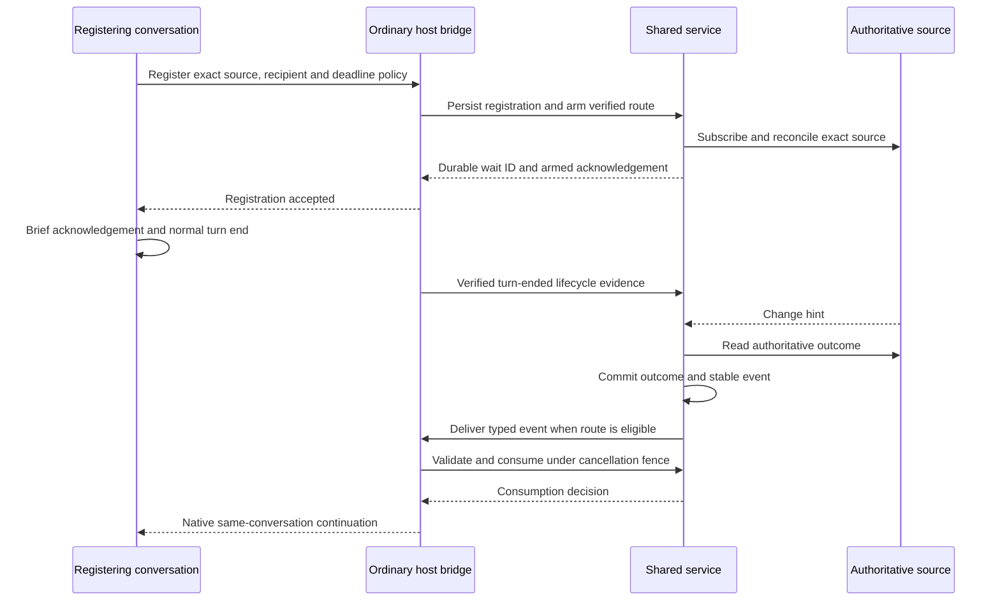

# Design v0.13.0: Shared wait service

Reference requirement: [feature-request.v0.13.0.shared-wait-service.md](feature-request.v0.13.0.shared-wait-service.md)

Focused draft: [draft.v0.13.0.shared-wait-service.md](draft.v0.13.0.shared-wait-service.md)

Umbrella: [draft.v0.13.0.no_polling.md](draft.v0.13.0.no_polling.md), item 1.

Status: consolidated after specification review round 3. Host bindings remain provisional
until the required native-wake probes provide evidence.

## Context for the v0.13.0 shared wait service

Ordinary code can already monitor local work. The missing boundary is a durable
registration that lets an agent finish its turn normally and later receive a
useful continuation in that exact conversation, without model requests while
the source remains unchanged. The requirement's 17 confirmed decisions govern
this design; the service must preserve existing workflow ownership and human
gates independently of host delivery.

## Scope of the v0.13.0 service core

Item 1 provides a local service authority, registration and delivery contracts,
durable lifecycle bookkeeping, source and host ports, synthetic fixtures,
standalone evidence collection and preliminary native-host probes. Initial
operation targets one Windows machine and its current OS user, with ordinary
Codex and available Claude TUI conversations left open after normal turn end.

Production check and review sources belong to umbrella items 2 and 3. Production
Codex, Claude and Copilot adapters belong to items 4 through 6, instruction
migration to item 7, actual A/B-service evidence to item 8 and Gemini to item 9.
Desktop apps, remote or WSL execution, multiple machines and reopening closed
TUIs remain outside initial support. This document contains no implementation
sequence or rollout plan.

## Confirmed technical facts from the current repository

| Existing authority | Confirmed behavior and design consequence |
| --- | --- |
| [Exact exchange wait](../../tools/review_exchange_wait.py) | One in-process loop uses a monotonic deadline, exact authoritative observations, optional progress and typed terminal outcomes. Moving observation into a service must preserve those outcomes without requiring a foreground wait. |
| [Review notifications](../../tools/review_resume_notifications.py) | A watchdog observer subscribes before scanning, coalesces relevant file hints and supports timed rescans when notification startup fails. Hints are suitable scheduling inputs, never proof of completion. |
| [Exchange ownership store](../../tools/review_exchange_ownership_store.py) | Exact exchanges use an OS transition lock and synchronized atomic coordination replacement. Durable records contain ownership digests; session capabilities remain separate. The wait service must not become a replacement ownership authority. |
| [Review artifact configuration](../../tools/review_artifact_configuration.py) | The default artifact home is `.reviews`; an optional declaration resolves a physical repository-local home. Registration must receive this resolved identity from the caller. |
| [Groundhog lifecycle](../../tools/groundhog/status.py) | The current status file distinguishes running, done and lost work; hidden detached launch and bounded startup acknowledgement already exist. The status grammar has a PID and timestamp but no dedicated immutable run UUID, so the later production source must resolve exact-run identity explicitly. |
| [Project environment](../../pyproject.toml) | The project requires Python 3.13 and already declares watchdog. Shared launchers and the resolved Python environment remain the execution boundary. |

These facts do not prove a working native Codex or Claude wake route. A queue
write, an exposed tool name or a successful API response is insufficient proof
that an idle, normally ended TUI conversation will continue automatically.

## Target flow across the shared wait boundary

The ordering of host receipt, native wake and consumption is host-dependent.
Following decision Q13, each route declares either directly observed
normal turn end or proven host-gated normal turn end. The latter delegates the
diagram's turn-end gate to a native queue whose normal-end and interruption
behavior has been demonstrated. A route providing neither is retained-result-only.
Where a host can consume before waking, the bridge suppresses cancelled events
without inference. Where native wake precedes a consumption callback, the first
ordinary callback must validate consumption before workflow continuation. Such
a route must report cancellation-induced wakes separately. A bridge unable to
enforce that boundary cannot claim strict automatic support.

Completion may precede registration, arming or turn end. It is persisted and
held until the original turn has ended normally and the recipient is eligible;
it never needs a second source change. Stop, Cancel, interrupted tools and a
closed TUI do not produce the normal-turn-ended signal.

## Service ownership, discovery and local IPC

### One process per OS user, machine and explicit state home

Use an on-demand hidden Python process owned by the current OS user. Its local
state home is `%LOCALAPPDATA%/llm-shared/wait-service`, independent of repository
and worktree. An OS-held exclusive lock on that home's singleton lock file
serializes startup and remains held for the process lifetime. A PID or discovery
file alone never proves ownership. All installations using the default home
discover the same authority; incompatible installations report a typed conflict
rather than silently starting a second authority over another database.

Following decision Q14, development and tests may explicitly select a
different canonical local state home. Resolve physical path aliases consistently
before deriving its identity. Each home has its own singleton and database; its
pipe name derives from the user SID plus that canonical home identity. Overrides
are explicit in launch configuration and visible in `hello`, discovery and
status. Clients never infer another home from cwd or silently fall back to the
default if an override fails. Live service tests must use an isolated home.

The launcher resolves the shared root and Python environment before launch.
It passes each consuming repository's resolved context explicitly. The process
uses a hidden surviving launch, does not depend on an initiating shell's stdin
or stdout, and must prove survival after that shell exits. Startup has a finite
15-second readiness bound. A concurrent starter connects to the lock holder.
If the lock is held with no reachable endpoint, it retries lock acquisition
within that bound: the holder may be a brief offline status read. At the bound
it reports `startup-timeout`; it does not kill or replace a healthy owner.

The initial lifecycle is explicit stop or restart, with no automatic idle exit
or startup task installed at user logon. A surviving host bridge reconnects and
may start the service after failure. After a machine reboot or closed host, an
ordinary launcher or local status/recovery action starts it; durable outcomes
remain retained meanwhile. Sleep and hibernation preserve the process lifecycle.

### Windows named pipe with explicit user access

Use a local named pipe identified by a digest of the user SID and canonical
state-home identity, with an explicit
security descriptor granting the intended user's access, remote clients
rejected and the peer identity checked before processing requests. Apply
equivalent user access protection to the state directory and database. Default
pipe permissions are unsuitable because they include broader read access.
The transport port hides Windows API details from service policy.
[Windows pipe security](https://learn.microsoft.com/en-us/windows/win32/ipc/named-pipe-security-and-access-rights)
documents descriptor-based access control; [CreateNamedPipe](https://learn.microsoft.com/en-us/windows/win32/api/winbase/nf-winbase-createnamedpipea)
documents local pipe options and first-instance behavior.

Create the initial pipe instance with `FILE_FLAG_FIRST_PIPE_INSTANCE`; a
squatted endpoint is a typed conflict, never an invitation to use it. Before
sending any frame, each client verifies that the process behind the connected
server handle has the same token user SID as itself. Failure to establish that
identity closes the connection. The service likewise verifies client identity.
[GetNamedPipeServerProcessId](https://learn.microsoft.com/en-us/windows/win32/api/winbase/nf-winbase-getnamedpipeserverprocessid)
provides the server process identity for this check; a predictable name or a
matching discovery file alone is not authentication.

Use bounded, length-framed UTF-8 JSON, never executable object serialization.
The initial maximum request or response frame is 64 KiB and inline outcome data
is limited to 8 KiB. Larger authoritative results use validated references.
Pagination bounds status output. Unknown operations, unsupported required
features, invalid fields and oversized frames produce typed errors.

An initial `hello` carries protocol major/minor, build identity, enabled port
kinds and feature support. The service returns its instance UUID, canonical
state home, store schema version and operational status. Major incompatibility
refuses mutation; minor
compatibility requires all requested features. Discovery metadata is an atomic,
non-secret hint containing the instance identity, state home, endpoint and owning build.
Readiness is acknowledged only after the store is recovered, IPC access is
enforced and operations can be served.

### Local trust and workflow permission remain distinct

Initial IPC trusts processes of the same OS user. Process ID, process start
identity where available and the verified OS peer identify registrant provenance;
claimed host/thread identity is separately validated by the host binding.
Status exposes when the registrant is different from the recipient. Foreign
users are refused; the initial contract does not add an unproven session-secret
authentication scheme.

The workflow authority validates the exact source, role, ownership generation
and allowed continuation at registration and again at consumption. A same-user
process cannot use a wait event as a review claim or human approval. Review
requestors and reviewers never create, register, wake or start each other.
Ownership capability secrets remain session-local and are not copied into the
service database, event payloads, diagnostic logs or benchmark reports.

## Durable records and transaction boundaries

### SQLite store and compatibility policy

Use a local SQLite database with a single service writer, explicit transactions
and full durable journal synchronization. The initial choice is rollback journaling;
status reads are short and paginated. Registration acknowledgement, outcome plus
event creation, cancellation and consumption each require a successful commit.
SQLite supplies the transaction boundary; its durability depends on the local
filesystem honoring synchronization, so storage errors cannot become success
acknowledgements. [SQLite atomic commit](https://www.sqlite.org/atomiccommit.html)
and [transaction semantics](https://www.sqlite.org/lang_transaction.html) describe
these guarantees and the single-writer constraint.

The service alone owns schema migration under its singleton lock. It accepts a
known schema or reports `schema-incompatible`; it never silently resets an
unknown store or downgrades it. Initial version creation is automatic on an
absent store. Later schema changes require an explicit local maintenance action
with a recoverable backup; clients cannot migrate storage by registering work.
Corruption, disk-full and failed commits produce a concrete unavailable state.
They do not trigger an empty replacement database or replay from guessed state.

### Persistent entities and their identities

| Entity | Durable contents |
| --- | --- |
| Registration | Wait UUID; caller idempotency key and canonical intent digest; exact source and recipient; provenance; role and continuation kind; explicit finite UTC deadline or indefinite policy; registration and arming acknowledgement state |
| Source identity | Registered source kind; canonical repository/worktree and artifact home; exact run/exchange, round and generation; source policy version |
| Host binding | Host kind and version; exact thread/session; verified local storage/profile identity; connection incarnation; capability classification; arming and normal-end evidence; route policy version |
| Source observation | Pending, ready, unknown or invalid observation; authoritative completion time and generation; observation UTC; result identity/reference; bounded typed data; access-loss recovery start |
| Wait outcome | Immutable ready, expired or monitoring-failure outcome; stable event UUID; source evidence; deadline decision and clock uncertainty |
| Delivery | Event UUID; binding incarnation; eligible, queued, accepted, retry-scheduled, unavailable or exhausted state; attempt count, receipt and diagnostic |
| Consumption | Event UUID; recipient and authority generation; atomic authorization/cancellation decision; consumption UUID; workflow receipt or unresolved execution state |
| Cancellation | Durable cancellation timestamp and origin; suppression decision; preserved source outcome and any accepted delivery evidence |
| History and tombstones | Bounded diagnostic history and compact deduplication facts after terminal detail cleanup |

Canonical intent includes source, recipient, deadline policy and continuation.
An identical idempotency-key retry returns the same wait and current
acknowledgement state. A conflicting digest returns `idempotency-conflict` and
the existing wait ID without mutation. Reconnect incarnation is changed only
through rearming, never by silently rewriting a retried registration.
Missing both deadline policies is a validation error before insertion.

Source identity includes physical repository/worktree identity and the exact
artifact generation, not merely a display path. A replaced worktree, moved
artifact home or reused run label cannot redirect an existing registration.
The later Groundhog source must supply a verifiable generation boundary before
it is eligible for this port.

### Preparing a registration without losing early completion

Registration has durable `preparing` and `armed` states. After validation, the
service persists the intent, installs or shares a source subscription, reads the
source and negotiates the route. It stores any early outcome and commits armed
acknowledgement only after the host confirms a usable route. The caller receives
success only then. An arming failure returns a typed non-armed result with the
wait ID, preserving diagnosis and any source outcome; an identical retry can
resume preparation. A crash after commit but before the reply returns the same
acknowledgement on retry.

The route declares its normal-end evidence capability. With direct evidence,
the bridge reports normal completion of the exact registering turn before
dispatch. With proven host-gated turn end, dispatch may enqueue earlier only
when the native queue defers useful delivery until normal idle and the probe
demonstrates suppression after Stop, Cancel or interruption. The evidence kind
is persisted with the binding. Without either capability, retain the result
for manual resume and never acknowledge automatic arming.
Source readiness and arming can occur in either order; delivery eligibility
requires the declared gate and valid route/authority. A busy conversation
keeps the event queued. Unavailable capability can instead be explicitly
registered for retained-result/manual-resume behavior, whose acknowledgement
never says an automatic route is armed.

## Source monitoring and recovery scheduling

### Authoritative observations with shared subscriptions

The source port accepts an exact identity and produces typed observations with
an authoritative generation and completion timestamp when available. It also
declares which result details are required before continuation. Notification
callbacks only mark the source dirty. The service subscribes before the initial
read, coalesces dirty hints and performs authoritative reconciliation.

All subscribers to the same canonical source identity share one watch and one
observation schedule; authorization, deadline, cancellation and delivery stay
per registration. A shared observation must not copy permission between waits.
Callbacks cannot invoke a model, execute result text or create another workflow.

Use a single scheduler for dirty sources, deadlines and retries, with bounded
ordinary workers for blocking source/host I/O. No worker sleeps per wait. A
source-kind policy declares notification availability, fallback cadence,
maximum observation duration and recovery interval before that kind's first
registration. Synthetic defaults are a 30-second reconciliation ceiling and a
60-second access-loss interval. Later production kinds must declare suitable
values and retain the applied policy version with registrations.

Access failures remain `unknown` during the fixed recovery interval. Its start
is durable and a process restart does not reset it. A recovered read resumes
normal reconciliation; exhaustion yields one `monitoring-failure` event. This
outcome describes the monitor, not a failed underlying test or review. Missing
or malformed authoritative identity never becomes completion based on log growth.

### Finite deadlines, suspension and UTC changes

A finite deadline is absolute UTC and is persisted at registration; suspended
time counts. Local monotonic time schedules activity only within one running
process. Persisted records never reuse raw monotonic deadlines after restart.
Resume, bridge reconnect and detection of a scheduling or UTC discontinuity
trigger reconciliation in ordinary code, not a wake merely to check health.

For a still-pending finite wait, authoritative source completion at or before
the deadline wins even when observed after resume. Use a comparable source
completion timestamp when supplied. In its absence, an authoritative read
showing readiness at service UTC at or before the deadline establishes an
upper bound on completion; retain that observation as evidence, not as an
invented source timestamp. If readiness is first observed after the deadline,
it wins only with authoritative completion evidence at or before the deadline;
otherwise expire, including when completion is absent or timestamped later.
Timestamp-less source kinds can therefore accept finite waits.

Observation time serves only as an upper bound proving on-time completion,
never as evidence that completion was late. This is the design's reading of
SW-05's rule to use source completion time rather than service observation time.

An unreadable source is a separate case: unknown within its source-kind recovery
interval, then monitoring failure if access cannot be restored. Record UTC
uncertainty and any contradictory clock evidence. An observation spanning an
unresolved clock discontinuity cannot supply a reliable upper bound; a resume
timestamp alone cannot establish on-time completion. No terminal outcome is
reopened by later evidence.

A forward UTC correction can expire a pending wait and a backward correction
can delay expiry. Neither reopens a terminal outcome or repeats consumption.
When source and service clocks cross a correction, retain the evidence and
uncertainty used by the decision. Indefinite waits remain indefinite. All missed
timer activity coalesces into one current reconciliation rather than a series
of missed-check wakes.

## Delivery, cancellation and consumption

### Stable events and bounded delivery attempts

An outcome and its event UUID are committed together before any send. The event
contains a wait ID, exact source identity, typed outcome, bounded structured
data, authoritative result reference and a stable continuation kind selected
from an allowlist. Sources and registrants supply no arbitrary continuation
prompt, shell command or executable template. Host adapters render fixed text
from typed fields and keep untrusted result content explicitly separate.

Transport acceptance is only a delivery receipt. It cannot mark the workflow
consumed. Retransmission reuses the event UUID even if the native transport
requires a fresh request ID. A host without native deduplication must use an
ordinary bridge inbox to deduplicate before useful workflow consumption.

Each route kind declares a finite attempt bound before use. The initial
synthetic policy allows three attempts, with delays of 1 and 5 seconds after
unchanged failures. Attempt counters and next eligible UTC time survive
restart. Exhaustion retains the event and diagnostics and stops automatic
retries. Explicit local retry or validated recovery starts a recorded new
attempt epoch; repeated unchanged connection notifications do not reset it.
An accepted event is not resent merely because useful continuation is slow:
first reconcile its receipt/consumption state through ordinary host code.

### The atomic cancellation fence

Cancellation and consumption serialize in the same service transaction domain.
A cancellation acknowledgement means suppression is durable. The consume
operation checks cancellation and existing consumption, verifies the intended
recipient and records authorization atomically. If cancellation committed first,
consumption returns `cancelled`, regardless of whether source readiness, expiry,
queueing or transport acceptance happened earlier. Source evidence remains.

The workflow port supplies fresh authority validation for consumption. Following
decision Q05, it records a durable in-flight consumption intent
under the existing workflow transition lock before submitting the service
request. The intent names the exact event, recipient, ownership generation and
unique attempt UUID, without a session secret. Workflow ownership transitions
must settle such an intent or use the explicit human abandonment below before
advancing its generation. This durable fence
survives an adapter crash that releases the OS lock.

The service serializes consume and settle operations for that attempt. Settle
returns its committed decision, or commits a rejected tombstone if no decision
exists; a delayed consume cannot override that tombstone. The workflow adapter
reconciles the returned receipt under its transition lock before clearing the
intent. An unavailable service leaves a typed consumption-resolution-pending
state; it grants no new workflow permission or automatic ownership transfer.
The later review adapter in umbrella item 3 must integrate and prove the intent,
settlement and explicit human abandonment fence for claims and explicit pickup
before production support. Synthetic authority fixtures exercise these obligations
in item 1; no existing review protocol is changed here.

If settlement cannot complete because the service remains unavailable or its
store is unusable, an explicit local human action may abandon the unsettled
attempt. Under the existing workflow transition lock, it durably records the
attempt UUID, exact event and recipient, old generation, reason and pending
recovery reconciliation, then permits the existing authorized ownership
transition to advance the generation. The abandonment record remains after
the in-flight intent is cleared. This action never runs automatically and
grants no separate claim, approval or continuation authority.

The resumed turn's Q06 validation of its consumption UUID against current
workflow authority rejects authorization bound to the abandoned generation
before any dependent effect. Once the service recovers, and before the current
owner consumes that event, the adapter submits the durable abandonment evidence
under current workflow authority. The service
settles the old attempt and marks any committed authorization superseded;
delayed requests cannot restore it. The retained event becomes eligible for
current-owner consumption only through the usual cancellation, recipient,
result and authority checks. This recovery does not replay completed work or
erase an uncertain effect: Q06 receipt reconciliation or explicit resolution
still governs any effect that began before abandonment. A failed reconciliation
keeps the abandonment evidence for retry without undoing the ownership change.

A service-monotonic budget limits admission and work before the authorization
commit begins, and the client waits longer by a declared margin. Neither budget
proves that a timeout means no commit: a reply can be lost after a successful
commit, or commit completion can outlast an I/O budget. A timeout is unknown,
so the adapter settles the same attempt and performs no continuation until a
definitive receipt is known. It may release its OS lock while the durable intent
continues to block automatic generation advance. The service never takes a workflow lock;
no source worker holds the store write lock while waiting for a workflow lock.
No source I/O runs inside a store transaction.

An accepted native wake may be impossible to retract. If it fires after durable
cancellation, report `cancellation-induced-wake`, reject consumption and perform
no dependent workflow action. Cancellation after consumption reports that
authorization has already occurred and follows existing execution semantics.
It does not retroactively undo a consumed action.

### Workflow receipt and the crash gap

The service returns the same consumption UUID for repeated authorized consume
requests. On a consume-before-wake route, missing turn-start evidence leaves
the native wake re-deliverable under that UUID, using the route's bounded
retry/recovery policy. The resumed turn's first ordinary callback validates
that UUID and current workflow authority before any dependent effect. Duplicate
wakes are counted separately and cannot repeat useful consumption. Routine
bridge restart before native wake therefore does not require human resolution.

The host/workflow adapter uses the consumption UUID as an idempotency identity
and records the workflow receipt after useful handling. `execution-unresolved`
applies to an uncertain workflow effect after the resumed turn's validation,
not to missing evidence of native wake. Recovery consults authoritative workflow
receipts and either confirms completion, safely resumes an idempotent operation
or retains the unresolved effect for explicit local resolution. Unknown status
of the consumption transaction itself uses the Q05 attempt settlement fence.

This provides one logical consumption decision without promising exactly-once
arbitrary side effects across process crashes. A lost service reply, lost
transport receipt or duplicated event cannot by itself rerun underlying work.

### Result validation, rearming and explicit rebinding

Before authorization, the workflow port validates all required result details
against their exact reference, generation and available digest. Missing details
produce `result-unavailable`; replaced or mismatched details produce
`result-invalid`. Retain the immutable outcome and suppress dependent
continuation until validated recovery or explicit resolution. A summary cannot
substitute for required authoritative details, and the service never reruns the
source to replace lost evidence.

The host bridge may rearm the same verified thread/session after reconnect or
during a later turn, subject to current workflow ownership. It records a new
connection incarnation and makes any obsolete delivery path ineligible. The
service never wakes the model solely to request rearming. A different recipient
requires an explicit local human action naming the retained wait and new
verified recipient, plus existing workflow authority; ambiguous bindings stay
pending. Rebinding cannot replay an already handled event or bypass unresolved
effects; superseding an abandoned authorization follows the Q05 recovery fence.

## Status, retention and operational bounds

Ordinary local commands expose service status and paginated wait details:
registration/arming state, source outcome, route state, cancellation,
consumption, age, deadline, retry budget, applied policies and recovery reason.
They show instance/build/protocol identity and IPC/storage errors without
loading conversation context or inferring through a model. Stop checkpoints
durable state and releases resources; restart reconstructs work from the store.
Offline status is explicitly a snapshot, never a current armed-route claim.
Before opening the database, offline status must acquire the singleton lock
without blocking. If another process holds it, use IPC or report starting/busy;
do not open the store outside the lock. This matters because a SQLite reader
may roll back a hot journal after a crash, which writes the store. Keep the
lock through recovery and snapshot reading, then release it. Offline status
does not migrate schema. [SQLite hot-journal recovery](https://www.sqlite.org/lockingv3.html)
describes this read-triggered recovery.

Automatic cleanup retains terminal details for seven days after final
consumption or durable cancellation; an accepted-but-cancelled event retains
its cancellation evidence for that period. Active registrations, pending
preparation and any outcome awaiting consumption or unresolved execution are
excluded, including expired and monitoring-failure outcomes awaiting handling.
Their state and age remain visible until explicit cancellation or resolution.

After detail cleanup, compact tombstones preserve wait/event IDs, idempotency
key and intent digest, cancellation/consumption decision and final disposition.
They have no automatic expiry, so delayed retries cannot create a new wait.
An explicit local purge can remove them and reports that deduplication history
is being removed; it never targets source artifacts, review exchanges or logs.

The initial admission bounds are 10,000 non-purged live/unconsumed waits and
1,000 distinct active source identities per user. New work above a bound returns
`capacity-exceeded` without evicting retained results; status and cancellation
remain available. Diagnostic history is size-bounded separately from durable
outcomes. Threshold changes are versioned local configuration and do not alter
existing deadlines, retry epochs or source recovery windows.

## Provisional host ports and capability evidence

### Port contract before a production host binding

The abstract host port provides capability discovery, exact-recipient validation,
arming, per-route normal-turn-end evidence, delivery/receipt reconciliation and same-session
rearming. The workflow port separately validates continuation authority and
required details. A host-local inbox may persist transport deduplication and
bridge state, but service outcomes remain authoritative.

The normal-end evidence kinds are `direct-turn-evidence`, `host-gated-turn-end`
and `unavailable`. Decision Q13 permits the second only when native
queue gating and suppression after Stop, Cancel and interruption pass the
probe; lack of a service-side callback alone does not exclude a proven queue.
An unavailable normal-end capability prevents automatic arming. An operator
marker can measure a probe interval but cannot implement the production gate.

Capability has four explicit results: `strict-idle-supported`,
`retained-result-only`, `direct-pending-tool-fallback` and
`unsupported-or-misconfigured`. Strict idle requires durable arming and the
verified normal-end/automatic-wake path and adequate request-coverage evidence.
Functional wake with inconclusive coverage is recorded separately and cannot
receive that strict support label. A fallback that retains a pending tool
is finite and explicitly labeled. No route silently becomes model polling.

These are semantic ports, not a frozen host API. If no available route
functionally proves arming, normal turn end, quiet waiting and automatic useful
continuation in the same conversation, item 1 may continue independent core
and collector work but requires a human checkpoint before host-interface
freezing or closure. One passing route permits closure under the remaining
gates; each unproven host retains provisional assumptions for its later item.

### Codex-first and independent Claude probes

Use a minimal ordinary-code harness with durable synthetic registration,
outcome and delivery evidence before substantial service implementation fixes
the host boundary. Probe Codex first, then available Claude independently,
without altering model/provider, approval, permission or telemetry settings to
manufacture a route. No automated reviewer or requestor counterpart is started.

For Codex record executable/version, exact thread UUID, actual profile/storage
and `CODEX_THREAD_ID`. Treat `codex queue` as a candidate until the existing
normally ended TUI actually wakes. A new queue request ID does not establish
idempotent consumption. Any App Server candidate must reach the backend and
thread that own the live TUI; an unrelated backend proves nothing about it.
Record the queue route's actual normal-end evidence kind and its behavior when
the registering turn stops, is cancelled or is interrupted. No exposed lifecycle
callback is assumed before inspection and the live probe.

For Claude inspect the actually exposed Monitor schema and Windows route. Its
silent bridge must survive normal turn completion and wake the same session.
Codex evidence is not Claude evidence. Record pass, fail, unavailable or
inconclusive for each host and lifecycle case, with the reason and exact build.
Record Claude's normal-end evidence kind independently; a Monitor command
bridge alone does not establish that turn boundaries are observable.

The baseline source stays unchanged for at least ten measured minutes after
verified normal turn end, using a host lifecycle event or an explicit operator
marker. Fixed finite wake-latency and duplicate-observation bounds are declared
before the series. Early completion, busy host, interrupted/closed TUI, bridge
failure, restart, lost receipt and cancellation have separate fixtures.
Automatic useful continuation must require no Enter, prompt or replacement
session. Functional wake with incomplete request coverage is recorded as
"wake observed, coverage inconclusive" and leaves strict acceptance open.

## Standalone measurement and evidence architecture

### Trial manifest and treatment separation

An ordinary-code driver owns each manifest, synthetic source release and raw
evidence location outside the measured conversation. It records pair/run/arm,
host/build/model/configuration, exact thread/profile, seed hashes and context
size, source identity, declared timing bounds and pre-start telemetry positions
and cumulative counters. Create it after the seed `READY` marker and before the
benchmark prompt. Freeze source documents and verify full retained seed reads;
predeclare a context-size matching tolerance, initially five percent.

Use three distinct arm identifiers: A for classic model-driven polling,
B-prototype for the minimal native-wake harness and B-service for the actual
service with a production host route. Item 1 requires A/B-prototype; item 8
requires A/B-service using the first available production route. Reports
cannot relabel a prototype run as service evidence.

Each comparison uses at least three fresh trials per arm, ordered A/B, B/A,
A/B. Hold host, model, reasoning, compaction configuration, instructions,
repository and permissions equivalent except for the wait treatment. Report
seed cost separately; retain natural polling context growth and attributable
post-seed compaction as measured effects. Repeat actual seed/configuration
mismatches or invalid telemetry while retaining the original evidence.

The nominal synthetic source interval is 240 seconds. A uses a 1,000 ms initial
yield where available, otherwise the supported minimum, followed by 60,000 ms
waits; this is a benchmark-only exception. B registers, acknowledges, ends
normally and automatically handles one result with `WAIT_TEST_DONE`. Record
actual tool delays and idle duration; 240 seconds since registration is not
240 seconds of model idle time. The ten-minute feasibility baseline is separate.

### Collector ports, normalized records and coverage

The collector receives explicit manifest/input/output paths and reads the
installed host's verified telemetry schema. Parsing adapters emit normalized
records for request attempts, usage-bearing completions, tool calls/results,
turn lifecycle, source readiness and delivery/consumption. Preserve original
identity/time, ingestion time and evidence location, including partial or
unknown fields. Exact thread identity controls inclusion; cwd or newest files
are never selectors.

Request coverage and usage coverage have independent confidence fields. A
usage record is not evidence that every attempted request was observed.
Deduplicate request identities and reconcile compatible cumulative deltas with
per-request counts, counting one representation. Preserve pre-start baselines,
counter reset epochs, retries, compactions, rotation and delayed/partial JSONL.
Cached-input semantics must be known before deriving uncached input; reasoning
already included in output is not added again. Missing values remain unknown.

Tool correlation follows call IDs and parent/orchestration relationships,
including polling hidden in generic execution commands and nested functions.
Mark unchanged-source observations separately from useful terminal processing.
Classify ambiguous or cross-boundary requests explicitly; do not force them
into a phase to obtain zero. Record actual transport retry/error evidence,
auxiliary approval/review usage and redacted proxy/CA settings independently.

### Phase boundaries and reports

| Measurement | Boundary |
| --- | --- |
| End-to-end | Benchmark prompt through final `WAIT_TEST_DONE` turn completion |
| Source runtime | Synthetic source start through authoritative readiness |
| Registration/setup | Benchmark prompt through B's registering-turn normal completion or A's first pending execution return |
| Actual wait | A's first pending return or B's verified normal turn end through source readiness |
| Wake latency | Source readiness through first useful continuation |
| Useful continuation | Useful result handling through final turn completion |
| Duplicate observation | Final turn completion through the predeclared finite window end |

Use UTC for correlation and monotonic elapsed durations within each process.
Early readiness is reported as overlap/zero quiet duration, not negative idle
time. A request's actual time determines attribution even if usage arrives
later. A finite collector-drain bound is fixed per series, initially 120 seconds
after the duplicate window, with early finish only on authoritative completeness.
Delayed records
beyond it produce a versioned amended report or an explicit coverage gap, never
a silent edit to a published result.

Report per-trial counts, phase costs, context comparisons, retries, compactions,
unknowns, source and quiet durations, wake latency and logical consumption.
Publish paired deltas, medians and ranges and all failed, invalid, repeated and
inconclusive trials. Baselines run awake; retain and repeat pairs affected by
suspension or UTC discontinuity, with recovery evidence reported separately.
Finite wake and duplicate bounds apply per host/version series; changing them
starts a new series and retains earlier misses.

Zero wait-induced inference requires adequate request coverage and correct
automatic continuation. Missing records, a quiet UI or no literal `wait` call
cannot establish zero. Registration and continuation overhead is reported even
when total token cost increases; no minimum net savings or billing/quota
prediction is a pass criterion. Raw evidence stays local; compact reports,
harness/collector invocations and redacted configuration live beside this effort.

## Acceptance evidence and closure boundaries

| Design case | Required evidence | Requirement |
| --- | --- | --- |
| Crash or retry during registration | One durable intent; typed conflict on changed intent; no success before usable arming; early result retained | AC-01, AC-03 |
| Startup and server identity races | Concurrent start, stale discovery, lock-holder crash, retry after a brief offline-status lock, foreign-user pipe squatting and hidden launch surviving parent exit; isolated homes remain distinct | AC-08, AC-12 |
| Concurrent subscribers and missed notifications | Shared observation with independent permissions, deadlines and recipients; bounded access-loss handling | AC-04, AC-08 |
| Restart between outcome commit and receipt | Stable event UUID and retained outcome; retry bound survives; no duplicate useful consumption | AC-05, AC-13 |
| Cancel before consume, including queued native wake | Atomic suppression; preserved source evidence; cancellation-induced wake classified | AC-07, AC-11 |
| Ownership displacement and wrong recipient | No stale authorization, cross-role creation or unverified rebind | AC-06, AC-08 |
| Consume timeout or adapter crash | Durable intent and same-attempt settlement; lost replies never imply no commit; explicit human abandonment permits ownership recovery during service failure, rejects stale-generation effects and reconciles superseded authorization without replay | AC-05, AC-08, AC-11 |
| Sleep, deadline boundary and clock correction | Deterministic source-time decisions, recorded uncertainty and unchanged terminal state | AC-09, AC-10 |
| Storage/IPC incompatibility and capacity exhaustion | Typed status and safe refusal without eviction, reset or false armed success | AC-12, AC-13 |
| Missing or replaced required result | Retained outcome and blocked dependent continuation until validated resolution | AC-05, AC-13 |
| Collector duplicates, baselines, resets and nested calls | Known synthetic counts and explicit unknown coverage without model calls or real sleeps | AC-16 |
| Native host feasibility and prototype trials | Per-host Q13 normal-end evidence kind and Stop, Cancel and interruption suppression cases; ten-minute quiet baseline, same-conversation useful continuation and matched A/B-prototype reports | AC-02, AC-14, AC-15 |
| Live Windows core suspension | Bounded real sleep/resume with a synthetic source and host, separate from awake A/B evidence | AC-09, AC-11 and item 1 closure |
| Production service comparison | Outstanding item 8 A/B-service evidence and strict coverage/support conclusions using actual adapters | AC-02, AC-15 |

Lifecycle fixtures use deterministic clocks and synthetic source, host and
authority ports, including crashes at transaction and receipt boundaries.
They exercise outcomes rather than merely mirroring internal methods. A bounded
live Windows core sleep/resume check remains mandatory before claiming core
recovery. Production adapter recovery is demonstrated in each later host item.

Item 1 closes only when the core fixtures, validated collector, preliminary
reports, per-host findings, live synthetic Windows recovery check and functional
route gate are satisfied. Incomplete telemetry leaves the strict zero-inference
criterion and support claim open for item 8. No implementation or probe result
is claimed by this design document.

## Design decisions for the v0.13.0 shared wait service

All 14 option A answers were accepted after specification review round 3.
No open questions remain for implementation planning. Host API bindings remain
provisional until the required native-wake probes establish their behavior.

| Question | Decision and reason | Integrated in | Rejected alternatives |
| --- | --- | --- | --- |
| Q01 | Start on demand with explicit stop/restart; retain offline work without adding a second installed lifecycle. | [Service lifecycle](#one-process-per-os-user-machine-and-explicit-state-home) | A user-logon task adds installation and version-selection behavior outside the initial lifecycle. |
| Q02 | Use a user-restricted named pipe, first-instance creation and reciprocal SID checks before frames; keep Windows details behind the transport port. | [Windows IPC](#windows-named-pipe-with-explicit-user-access) | Loopback HTTP adds credential distribution and lifecycle requirements. |
| Q03 | Use SQLite rollback journaling, full synchronization and short reads; offline readers hold the singleton lock and starters retry within 15 seconds. This provides one durable transaction domain. | [Store policy](#sqlite-store-and-compatibility-policy), [offline status](#status-retention-and-operational-bounds), [startup](#one-process-per-os-user-machine-and-explicit-state-home) | WAL adds checkpoints and side-file lifecycle; separate records require another atomic recovery protocol. |
| Q04 | Keep failed arming as typed non-armed preparation under the same wait ID, preserving early outcomes and identical retries. | [Registration preparation](#preparing-a-registration-without-losing-early-completion) | Removing preparation loses evidence and complicates recovery after an uncertain reply. |
| Q05 | Fence consumption with a durable workflow intent and same-attempt settlement; timeout remains unknown. Explicit human abandonment can restore ownership progress during service failure. Reconcile abandonment before current-owner consumption, retaining existing permission and receipt gates. | [Cancellation and authority fence](#the-atomic-cancellation-fence) | Moving workflow ownership into the service transaction store requires a broader persistence migration; timeout alone never proves no commit. |
| Q06 | Redeliver an unconfirmed native wake under the same consumption UUID and validate current authority in the resumed turn. Reconcile later effects against authoritative receipts; unverifiable effects require explicit resolution. | [Workflow receipt and crash gap](#workflow-receipt-and-the-crash-gap) | Human resolution for every uncertain wake interrupts cases that ordinary code can safely recover; arbitrary effects cannot be blindly replayed. |
| Q07 | Prefer comparable source completion time; a valid pre-deadline readiness read supplies only an on-time upper bound. First observed late without on-time evidence expires; unreadable state retains its bounded recovery policy. | [Deadline evidence](#finite-deadlines-suspension-and-utc-changes) | Rejecting timestamp-less finite waits excludes valid pre-deadline evidence; observation time cannot prove lateness under SW-05. |
| Q08 | Version policies per source and route kind. Synthetic defaults are 30-second reconciliation, 60-second access recovery and three delivery attempts with 1- and 5-second delays. Preserve each applied policy across restart. | [Source scheduling](#authoritative-observations-with-shared-subscriptions), [delivery attempts](#stable-events-and-bounded-delivery-attempts) | One global policy couples unrelated sources and routes and prevents suitable per-kind bounds. |
| Q09 | Retain terminal details seven days and compact tombstones until explicit purge; active, unconsumed and unresolved records stay outside cleanup. This preserves delayed-retry idempotency. | [Retention](#status-retention-and-operational-bounds) | Automatic tombstone expiry creates an idempotency horizon after which an old key can represent new work. |
| Q10 | Admit at most 10,000 live/unconsumed waits and 1,000 active sources, with bounded frames and diagnostics; refuse new work without evicting retained results. | [Operational bounds](#status-retention-and-operational-bounds) | A primary byte quota complicates sizing and reservation of capacity for recovery writes. |
| Q11 | Keep semantic host ports provisional; require machine-enforced consumption and lifecycle evidence, and report functional wake separately from request-coverage confidence. | [Host contract and capability](#port-contract-before-a-production-host-binding) | Freezing one native callback sequence before probing could exclude or misrepresent the available host route. |
| Q12 | Finalize collection after a declared drain bound, initially 120 seconds after the duplicate window; finish early only on authoritative completeness and preserve versioned amendments for late evidence. | [Measurement phases and reports](#phase-boundaries-and-reports) | Waiting indefinitely for a host completeness signal prevents termination when no such signal exists. |
| Q13 | Accept direct turn-end evidence or a proven native host gate, including Stop, Cancel and interruption suppression; otherwise retain results for manual resume. An operator marker is measurement evidence only. | [Flow](#target-flow-across-the-shared-wait-boundary), [arming](#preparing-a-registration-without-losing-early-completion), [host probes](#codex-first-and-independent-claude-probes) | A mandatory direct callback excludes proven native queues; unconditional dispatch can wake during a turn or after interruption. |
| Q14 | Keep one authority per canonical state home, with explicit development/test overrides visible in endpoint identity, hello, discovery and status. | [State-home isolation](#one-process-per-os-user-machine-and-explicit-state-home) | Default-home-only operation prevents live tests or development builds alongside stable use. |
