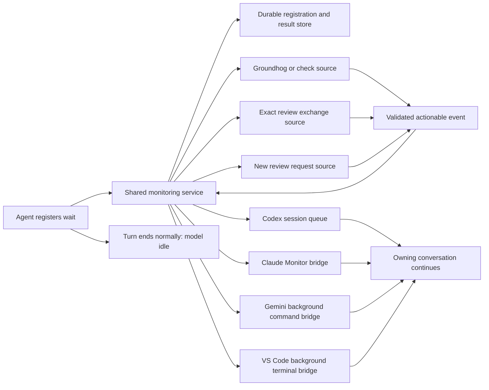

# Wake Me When It Matters

<!-- markdownlint-disable MD013 -->

- Type: collection (feature-requests and issues)
- Draft role: umbrella
- Status: ordered collection; requirements and implementation pending
- Target version: 0.13.0
- Research date: 2026-09-14
- Targets: Codex CLI/TUI, Claude Code CLI/TUI, Gemini CLI, and VS Code GitHub Copilot Chat
- Historical input: [Codex wait token analysis](../draft_codex_wait.md)

## Purpose and draft status

Let an agent register what it is waiting for, finish its current turn, and
remain idle until an ordinary monitoring process detects an actionable event.
The host then continues the original conversation. Waiting must cause no
periodic LLM requests and no periodic submission of the conversation context.

One shared monitoring service should serve all four targets and all supported
wait sources. The immediate use cases are completion of `check.bat` or a
Groundhog run, arrival of an answer to a published review request, and arrival
of a new request for an independently waiting reviewer.

This file preserves the motivation, repository findings, host integration
research, proposed behavior, unresolved choices, and validation needs. It is
the canonical umbrella for `no_polling`, titled **Wake Me When It Matters**,
targeting version 0.13.0 in `docs/v0.13.0/`. The ordered index below defines
the requirement boundaries and delivery sequence. Each item has its own slug
for its focused draft and requirement. All collection items use the
`no_polling` branch in the single `llm-shared_no_polling` worktree, as requested
by the user; continuing an item must not create a separate item worktree.

The umbrella preserves research and proposed constraints; it does not replace
the focused requirements, designs, plans, or implementation evidence. Every
item starts pending. Host integration candidates remain unverified until
their stated evidence is collected.

That distinction follows the repository's [artifact conventions](../../wiki/reference/artifact-files.md),
[process-draft instructions](../../instructions/process-draft.md), and
[split-and-define instructions](../../instructions/split-and-define.md).

## The problem to solve

The historical analysis records repeated wait/status interactions carrying
large contexts despite returning almost no useful information. It reports
43.3 million wait-related input tokens on September 9 and 27.8 million on
September 10, approximately 20.0% and 23.6% of those days' input respectively.
Its example of 290 wait calls and 27.82 million input tokens corresponds to
roughly 96,000 input tokens per wait.

These are figures reported in the [earlier draft](../draft_codex_wait.md), not a
fresh benchmark. Workload varied between the days. They motivate eliminating
unnecessary model requests; they do not establish a guaranteed percentage
saving, billing reduction, or quota conversion for this proposal.

The expensive boundary is a timeout returning control to the LLM, which then
decides to wait again with the conversation supplied as input. An operating
system sleep, file notification, database check, or script retry does not
itself require inference. The design must move the entire quiet interval
across that boundary, into ordinary code.

The earlier draft explored a direct blocking MCP wait with a long tool
timeout. Such a call can avoid intermediate model requests while it remains
pending. It leaves the agent turn waiting on a tool, however. The stronger
requirement here is registration followed by normal turn completion, with a
later host event starting useful work again.

The earlier statement that a script cannot wake an ordinary Codex CLI must
also be qualified by version: the inspected Codex 0.154.0 includes a native
session queue and a background queue watcher. This creates a more direct TUI
integration candidate than making a custom App Server controller mandatory.

## What "no polling" means

The required contract is **no LLM polling**. It is not a promise that every
operating system, database, source adapter, and host implementation contains
no timer or local polling loop.

| Activity during an unchanged wait | Meets the intended contract? |
| --- | --- |
| Service waits on a process handle, file notification, or IPC subscription | Yes |
| Service periodically calls an authoritative status reader in ordinary code | Yes, with a bounded and justified cadence |
| Host checks a local queue without making a model request | Yes |
| Bridge blocks quietly while the conversation is idle | Yes |
| LLM calls `wait`, checks a status command, or narrates unchanged progress every minute | No |
| Another LLM or subagent performs those checks instead | No |
| A long direct tool call remains pending without intermediate inference | Useful separate fallback, but does not meet normal turn completion |

The intended lifecycle is:

1. The agent starts or identifies authorized work and registers a precise wait.
2. Registration succeeds durably and the host's wake route is armed.
3. The agent gives a short acknowledgement and ends its turn normally.
4. The application remains open, but the model performs no work for this wait.
5. Ordinary code detects and validates the relevant event.
6. The host receives one actionable notification and continues the owning
   conversation, which reads the result and follows its existing workflow.

Here, **stop means normal turn completion**. It does not mean pressing a
Stop/Cancel button, interrupting the agent, killing a tool, or closing the
application. Those actions can disable native wake routes. A closed host may
have a result retained for later resumption, but automatic reopening of a
closed TUI is not part of the initial compatibility claim.

"One wake" means one logical continuation for a new actionable event in the
normal case. That continuation can legitimately use several model requests
to read feedback, fix code, or run the next step. Delivery retries must be
deduplicated; exactly-once execution across arbitrary crashes must not be
claimed without a protocol that actually provides it.

Unrelated user messages and useful work may continue while a wait is armed.
Their inference is not waiting overhead. Periodic goals, scheduled prompts,
progress narration, or host automations must not recreate polling for the
registered wait.

## User scope and compatibility expectations

The primary experience is the existing `codex.exe` and `claude.exe` terminal
UI. Adopting the service should preserve those applications and their current
conversations. Codex Desktop and Claude Desktop are outside the initial scope.

Gemini means Gemini CLI. It is not installed in the available environment, so
its integration can receive documentation, source review, and simulated
adapter tests here, but cannot be declared live verified.

VS Code means its GitHub Copilot conversation using the relevant native agent
tools. The event mechanism belongs to the host, regardless of the selected
LLM. Selecting Claude inside Copilot does not expose Claude Code's Monitor;
selecting a GPT model does not turn that conversation into a Codex thread.
Limited live checks are possible with the user's available selections,
**GPT 5.6 Terra** and **Claude Sonnet 5**. Other models cannot be claimed tested.

A shared service should handle concurrent repositories, worktrees,
conversations, review roles, and wait types. The initial deployment target is
the user's Windows environment. Remote development, WSL boundaries, multiple
machines, and other operating systems need explicit capability and transport
decisions before they are advertised as supported.

## What already exists in llm-shared

### Groundhog and check completion

[The Groundhog instructions](../../instructions/groundhog.md) currently direct
the agent to launch a detached run where needed and poll `ghog status` until
the run stops being live. They prefer intervals of at least 120 seconds and
several minutes for a full walk. Increasing that interval reduces model
re-entry but does not remove it.

The authoritative lifecycle implementation is
[tools/groundhog/status.py](../../tools/groundhog/status.py). The workflow uses
`a.ghog.status`, but `ghog status` is the permitted external reader because it
also diagnoses a lost run. A growing log, a final-looking test line, a
timestamp, or the exit of a detached launcher is insufficient evidence of
completion. The worker already uses an ordinary process wait in
[tools/groundhog/runner.py](../../tools/groundhog/runner.py).

The service should reuse that status authority, either through its supported
command or a deliberately exposed equivalent API. A file event can trigger a
status recheck; it must not establish the verdict itself. Preserve running,
lost, setup failure, test failure, coverage failure, crash, duration outlier,
and successful completion semantics. Preserve `ghog check`'s pass-through
check result as well: a completed command's numeric exit code and the run's
lifecycle state are separate pieces of information.

For a directly managed `check.bat`, capture the actual worker's completion
and result. A wrapper that starts a child and immediately exits must not cause
a premature wake. Adopting the service must not launch duplicate healthy
Groundhog walks or truncate their existing logs.

### Waiting inside an exact review exchange

[tools/review_exchange_wait.py](../../tools/review_exchange_wait.py) already
keeps repeated counterpart checks inside a bounded Python call, with a
monotonic deadline and optional periodic progress. The existing requestor
instructions request one `wait-answer` invocation, with progress on standard
error and one final machine object on standard output.

The current [review CLI parser](../../tools/review_exchange_cli_parser.py) defaults
to a one-second internal poll and a 30-second progress interval. Those are
ordinary Python activities; they become a token problem if the host repeatedly
returns the agent to the model or forwards progress as actionable events.

The remaining problem is outside that Python loop: a host can yield the
long-running call and repeatedly return the LLM to a status-only interaction.
Wrapping the same call in another yielding tool does not prove that this
problem is removed.

The service should preserve the existing exact exchange, round, role,
ownership generation, and typed outcome rules. It must distinguish a matching
answer from a stale round, a superseded request, ownership loss, a stopped
exchange, a deadline, and an operational error. Raw file existence is not a
sufficient review answer predicate.

### Waiting for any new review request

[tools/review_resume_wait.py](../../tools/review_resume_wait.py) already provides
a quiet script-managed wait with authoritative rescanning and typed results.
[tools/review_resume_notifications.py](../../tools/review_resume_notifications.py)
provides a process-local native file observer, event signalling, and a polling
fallback. Subscription occurs before the initial scan to avoid a missed event.
The current waiter itself does not maintain durable waiter state.

This is useful reusable infrastructure. The proposed service adds durable
subscriptions and delivery to idle hosts; it should not introduce a second
review selection or ownership protocol. Preserve ambiguity handling and
atomic claim behavior. A notification that work exists is not itself a claim.

### Instructions and generated guidance also need migration

The current pull lifecycle appears in canonical instructions and in generated
Groundhog guidance, including
[tools/groundhog/init_files.py](../../tools/groundhog/init_files.py) and
[tools/groundhog/reporting.py](../../tools/groundhog/reporting.py).
Implementation must cover those emitted next steps as well as LLM-specific
entry points. Otherwise an agent can be told to register a wait in one place
and to resume periodic status checks in another.

## Proposed shared architecture

Use one monitoring authority per local user and machine as the initial design
candidate. It owns registrations, source subscriptions, durable results,
delivery state, and local diagnostics. It does not call a model or store a
copy of each conversation's context.



The core separates two responsibilities:

- **Source adapters** determine whether the registered condition is satisfied,
  using the existing source's authoritative semantics.
- **Host adapters** deliver a compact event through a mechanism that can
  continue the particular idle conversation.

One service does not imply one operating system process in total. Claude may
need a persistent bridge per session; Gemini and VS Code may need a quiet
background command per wait. These clients only subscribe, forward the final
event, or exit. They do not duplicate review scans or Groundhog monitoring.

Prefer native notifications and blocking IPC. Where a source needs periodic
reconciliation, perform it in the service, coalesce identical source watches,
and bound its cadence. A file observer must tolerate duplicate notifications
and missed events. Notifications are hints to read authoritative state.

The service's own logs, heartbeats, retries, and progress belong in local
diagnostics. They must not be forwarded as model-visible events merely to
prove that the service is alive. Particularly, do not stream existing review
progress JSON or Groundhog log progress into Claude Monitor or a host terminal
bridge that treats output as a reason to invoke the model.

## Registration, delivery, and recovery contract to develop

### Registration identity and acknowledgement

A registration needs enough information to bind the source to the right
recipient. Candidate fields, not a finalized wire schema, are:

| Information | Purpose |
| --- | --- |
| Wait ID and registration idempotency key | Retrying registration does not create duplicate waits |
| Source kind and canonical repository/worktree or artifact home | Resolve the intended source without relying on a daemon's working directory |
| Exact run identity or exchange identity, round, and generation | Reject completion of a different or superseded operation |
| Host kind, session/thread identity, and connection incarnation | Route to the registered conversation and detect stale bindings |
| Review role and permitted continuation | Preserve role boundaries and existing workflow authority |
| Host capability and armed delivery route | Establish that a normal turn can safely finish |
| Deadline or explicit indefinite-wait policy | Avoid treating routine adapter timeouts as work completion |
| Result and acknowledgement state | Support durable delivery and recovery |

Do not infer a conversation from the current directory, newest transcript,
active editor tab, or a fuzzy session name. Do not infer a particular run from
a reused PID alone. Where an existing source lacks a sufficiently durable run
identity, define the smallest compatible extension during design.

Registration must acknowledge that the durable record exists and that the
host route is usable. A host-managed background bridge must be established
before the agent is told it can end the turn. A persisted pending result must
also be delivered when the source completed before registration or before
the host became idle; the service must not depend on a future file change.

### Event content and trust boundary

An event should carry a stable event ID, wait ID, source identity, outcome,
bounded result data, and a reference to authoritative details. Prefer the
exact answer path or a compact check result to an entire transcript or log.
Use a stable continuation kind rather than an arbitrary shell command copied
from source content.

Host notifications are machine-generated information. They do not constitute
a new human approval, grant new permissions, or change an agent's role. This
must remain clear even if a host transport represents the notification as a
chat user message. The recipient validates the registration and resumes only
the already authorized workflow.

Keep session ownership capabilities out of user-facing messages and ordinary
logs. If source access requires one, bind it to the existing session and
protocol instead of reconstructing it from artifacts or accepting a stale
token as new authority.

### Delivery and source state must remain distinct

A possible lifecycle is registered, armed, waiting, ready, delivery pending,
delivered, and acknowledged, with cancellation, expiration, invalidation,
and operational failure represented explicitly. Design should decide which
states belong to the wait and which belong to the delivery attempt.

Persist an outcome before attempting host delivery. A successful enqueue or
bridge write means transport acceptance, not proof that the model consumed
the result. Retain enough information to reconcile a crash between sending
and recording delivery. Use stable event identity and idempotent workflow
operations to prevent repeated consumption.

If the host is busy, use its supported queue behavior and preserve ordering.
If the user cancels the wait, suppress future automatic continuation for that
registration. Cancelling monitoring must not silently terminate a healthy
check or change a review exchange. Cancelling the underlying work requires
its existing workflow semantics.

If the service or bridge restarts, recover without launching a second worker,
consuming a review twice, or repeatedly waking a host with the same failure.
If the session closes, retain the result and report delivery as pending or
unavailable. A resume policy must explicitly decide when to rebind it.

## Target assessment and evidence level

The research identifies native host mechanisms for all four targets. None
has yet been demonstrated here as an end-to-end shared-service integration.
The versions below are evidence anchors, not established minimum supported
versions or a promise about every future release.

| Target | Candidate wake route | Evidence collected | Remaining live check |
| --- | --- | --- | --- |
| Codex TUI | Native `codex queue` into the owning thread | Installed 0.154.0 CLI help; matching upstream queue and lifecycle source; upstream tests inspected | Separate queue writer wakes the user's ordinary idle TUI without model polling |
| Claude Code TUI | Monitor command or plugin monitor subscribed to the service | Installed 2.1.270 version/help; official Monitor and plugin documentation | Actual session exposes Monitor; quiet bridge wakes that same conversation |
| Gemini CLI | Native background shell completion injection | Official settings and v0.59.0 source paths | CLI unavailable; genuine idle continuation and long quiet waits remain untested |
| VS Code Copilot | Native background terminal completion notification | VS Code 1.137.0 terminal tool source | Bounded checks in the user's host with GPT 5.6 Terra and Claude Sonnet 5 |

For every adapter, distinguish a visible notification, context queued for a
later user prompt, and an actual automatic continuation. Only the last meets
the requested behavior while the host remains open and normally idle.

## Codex CLI/TUI integration

### Primary candidate: the native session queue

The installed Codex 0.154.0 exposes a queue command with a thread selector and
message. Its CLI adapter resolves a target and submits through
`thread/queue/add`; the message is represented as user input. This is an
existing command, not a proposed llm-shared executable. The following is an
illustrative shape with placeholders, not a command executed in this study:

```text
codex queue --thread <registered-thread-uuid> --message "Machine event: wait_id=w17 event_id=e17. Read the registered result and resume the authorized workflow."
```

Use an exact UUID and the same Codex storage/profile context as the owning
TUI. The shell used for research did not resolve `codex` on PATH, so local
help checks used the installed executable's full path. Adapter discovery must
handle that instead of assuming an interactive alias is an executable.
The current tool environment exposed `CODEX_THREAD_ID`; its availability and
binding must be validated in each supported launch path.

The implementation creates a client ID when invoking the queue command.
Calling the CLI again is therefore not, by itself, a stable retry key. The
service needs reconciliation and event deduplication, or an API adapter that
can retain a caller-controlled identity where supported. See the pinned
[queue command](https://github.com/openai/codex/blob/rust-v0.154.0/codex-rs/cli/src/queue_cmd.rs)
and [session queue adapter](https://github.com/openai/codex/blob/rust-v0.154.0/codex-rs/tui/src/session_queue_commands.rs).

### Why an ordinary TUI may already be sufficient

The inspected queue extension installs a background watcher. Its service
checks SQLite change state every ten seconds, skips unchanged queues, and
dispatches relevant queued submissions to loaded threads. An eligible idle
thread can be woken; an interrupted thread is deliberately excluded.

This is host-side database polling, not LLM polling. It can detect a message
written by a separate queue process using the same storage, so a shared App
Server daemon is not inherently required for the ordinary embedded TUI path.
The ten-second interval is an implementation detail and contributes detection
latency; it is not a promised delivery deadline. See the pinned
[queue extension installation](https://github.com/openai/codex/blob/rust-v0.154.0/codex-rs/ext/queue/src/lib.rs)
and [queue service](https://github.com/openai/codex/blob/rust-v0.154.0/codex-rs/ext/queue/src/service.rs).

Upstream tests cover idle queue dispatch and a persisted queued submission
dispatching after a cold thread resume. They were inspected, not run here.
They support the mechanism but do not replace a separate-process test against
the user's actual Windows TUI. See
[thread queue tests](https://github.com/openai/codex/blob/rust-v0.154.0/codex-rs/app-server/tests/suite/v2/thread_queue.rs).

Proposed flow: register the source wait and thread binding, end the agent
turn normally, then let the service enqueue a compact event on completion.
The existing TUI handles continuation. Avoid sending intermediate queue
messages, launching repeated `codex exec` requests, creating a second agent,
or writing directly into Codex's database.

A queued message's user-input representation makes the machine-event boundary
especially important. It must reference a validated registration and cannot
be treated as a human choice at a review confirmation gate.

### What integration with the relevant App Server thread means

App Server is Codex's conversation backend, distinct from this proposed
monitoring service. A thread identifies conversation state; turns identify
individual runs of the agent. An integration needs the particular thread
and the backend connection/configuration that owns or loads it. Starting an
unrelated App Server does not automatically attach to whichever conversation
the user happens to be viewing.

For a controlled App Server connection, the documented protocol can start a
turn with `toolOutput` and empty `input`. The result remains tool output in
history. `thread/inject_items` only adds context, while `turn/steer` targets
an active turn rather than an idle one. See the official
[App Server reference](https://learn.chatgpt.com/docs/app-server).

Illustrative completion delivery after initialization and thread binding:

```json
{
  "id": 42,
  "method": "turn/start",
  "params": {
    "threadId": "<registered-thread-id>",
    "input": [],
    "toolOutput": {
      "name": "shared_wait_complete",
      "namespace": null,
      "output": "{\"wait_id\":\"w17\",\"event_id\":\"e17\",\"state\":\"completed\",\"exit_code\":0}"
    }
  }
}
```

This is a potential host adapter, not a service API specification. It offers
a structured machine-result channel. Design would need to handle thread
loading, connection lifecycle, busy-thread behavior, experimental API
capabilities where applicable, and event acknowledgement. It must preserve
the TUI's chosen model, permissions, and conversation ownership.

Codex supports embedded and remote App Server paths, including a daemon
option. The research found a failed local daemon version probe and an absent
control socket. That is not sufficient to diagnose the daemon's health, and
it does not invalidate the embedded queue candidate. No daemon was started,
restarted, or reconfigured. See the official
[developer commands](https://learn.chatgpt.com/docs/developer-commands?surface=cli),
pinned [TUI connection code](https://github.com/openai/codex/blob/rust-v0.154.0/codex-rs/tui/src/lib.rs),
and [daemon implementation notes](https://github.com/openai/codex/blob/rust-v0.154.0/codex-rs/app-server-daemon/README.md).

The initial recommendation is to validate the native queue in the user's
ordinary TUI first. Keep the controlled App Server route as an alternative
if structured delivery or other measured requirements justify its additional
integration. A custom terminal UI is not an initial requirement.

## Claude Code CLI/TUI integration

### Native Monitor and a quiet service bridge

Claude Code documents a Monitor tool that runs a background command and turns
its output lines into events for the conversation. It also supports
persistent monitoring. The tool follows Bash command permissions, is
unavailable on Bedrock, Google Cloud's Agent Platform, and Microsoft Foundry,
and is disabled when `DISABLE_TELEMETRY` or
`CLAUDE_CODE_DISABLE_NONESSENTIAL_TRAFFIC` is set.

Its WebSocket source requires v2.1.195 or later and rejects private,
link-local, and cloud-metadata destinations, including resolving hostnames.
A direct localhost WebSocket connection is therefore not the proposed local
service bridge. Use a Monitor command that subscribes through local IPC.
See the official [Monitor reference](https://code.claude.com/docs/en/tools-reference#monitor-tool).

Proposed flow: start or reuse a session-bound Monitor bridge, register the
wait with that bridge armed, and let Claude finish its turn. The bridge
remains silent until the service has a relevant outcome. It then emits one
compact event line for that registration. Monitoring and reconnect retries
continue in code without asking Claude to check anything.

Prefer a persistent bridge for a session that repeatedly waits for reviews.
Each wait still has its own lifecycle; a persistent bridge does not make a
completed registration eligible to fire repeatedly. Send bridge diagnostics
to a local log, and define how an actual bridge failure becomes a single
operational event instead of a retry storm.

The installed version was 2.1.270. Version/help checks and limited environment
inspection do not prove that Monitor is exposed in the user's running
session. Confirm availability, actual tool schema, long-wait persistence,
Windows command launch/quoting, and idle continuation in a bounded live probe.
Do not silently change telemetry or provider settings to enable it.

### Plugin integration candidate

Claude plugins can declare experimental monitors in `monitors/monitors.json`
or their manifest. Monitors may start with an active plugin or a skill
invocation, and are intended for interactive CLI sessions. Their output feeds
the session; ending it stops them. Disabling a plugin during an existing
session does not necessarily stop monitors already running. See the official
[plugin monitor reference](https://code.claude.com/docs/en/plugins-reference#monitors).

This is a candidate packaging route for llm-shared: a session bridge could be
available before a wait-registration tool runs. The choice between an
explicit Monitor invocation and an automatically started plugin bridge
belongs in design, including capability discovery and cancellation.

Ordinary background command completion may be a fallback to investigate if
Monitor is unavailable. It needs its own idle-wakeup test; it must not be
advertised as equivalent merely because a command can run in the background.
An Agent SDK controller would own a different integration surface and is not
necessary to propose for the primary TUI experience.

## Gemini CLI integration

### Candidate: background completion injection

Gemini CLI documents `tools.shell.backgroundCompletionBehavior` with a default
of `silent` and an `inject` option. It also exposes the experimental
`modelSteering` setting, defaulting to false. For the inspected v0.59.0
interactive path, the candidate configuration is:

```json
{
  "tools": {
    "shell": {
      "backgroundCompletionBehavior": "inject"
    }
  },
  "experimental": {
    "modelSteering": true
  }
}
```

This is a proposed configuration to validate, not one installed by this study.
The documentation also gives shell inactivity timeout a default of 300
seconds. How that applies to a long, silent, background bridge must be checked
before promising indefinite waits. See the official
[Gemini CLI configuration](https://geminicli.com/docs/reference/configuration/).

The pinned source connects background completion to an injection service.
The interactive application consumes a pending injection when idle, with
model steering enabled and initialization/tool-confirmation conditions
satisfied, then submits a query. Setting completion behavior alone is
therefore insufficient evidence for this particular idle-continuation path.
See [AppContainer.tsx](https://github.com/google-gemini/gemini-cli/blob/v0.59.0/packages/cli/src/ui/AppContainer.tsx)
and [executionLifecycleService.ts](https://github.com/google-gemini/gemini-cli/blob/v0.59.0/packages/core/src/services/executionLifecycleService.ts).

The native shell tool supports background execution and carries the configured
completion behavior into its lifecycle. The service client must be launched
through that host-managed path so the host knows which completion belongs
to the conversation. A detached process started independently is not enough.
See the pinned [shell tool](https://github.com/google-gemini/gemini-cli/blob/v0.59.0/packages/core/src/tools/shell.ts)
and [shell execution service](https://github.com/google-gemini/gemini-cli/blob/v0.59.0/packages/core/src/services/shellExecutionService.ts).

Proposed flow: Gemini registers a wait and starts its native background wait
client; that client blocks on the shared service. Gemini ends the turn.
Completion makes the client print a compact result and exit. Native
background completion injection resumes the same conversation. The client
does not run independent source scans or repeated Gemini requests.

### Alternative controller and explicit testing limit

Gemini also documents ACP mode, entered with `--acp`, for a client controlling
sessions over a protocol connection. A controller could supply the next
prompt when an event arrives, but it would need to own that session. This
does not establish an external injection mechanism for an arbitrary already
running interactive TUI. See [ACP mode](https://geminicli.com/docs/cli/acp-mode/).

Keep native background injection as the TUI candidate and ACP as a separately
scoped alternative. Neither the CLI nor a live Gemini conversation is
available here. Record source-level feasibility and simulated tests honestly;
leave real shell lifetime, cancellation, settings, idle continuation, and
token behavior unverified until a suitable installation is available.

Do not work around a possible inactivity timeout by printing periodic lines
that could wake the LLM. Resolve the native timeout policy or report that the
strict wait capability is unavailable for that configuration.

## VS Code GitHub Copilot integration

### Native terminal completion, tied to the originating chat

In the inspected VS Code 1.137.0 terminal tool, background completion
registration retains the original chat session and request options, including
the selected model. On a command-finished event it submits a system-initiated
request to that session. The path requires terminal command detection through
shell integration and excludes subagent invocations. Cancellation, terminal
disposal, and shutdown can remove the registration. See the pinned
[runInTerminalTool.ts](https://github.com/microsoft/vscode/blob/1.137.0/src/vs/workbench/contrib/terminalContrib/chatAgentTools/browser/tools/runInTerminalTool.ts).

This supports a model-independent adapter candidate for the primary native
Copilot agent conversation. It does not establish the same behavior for
every VS Code extension, an independently created terminal, or every new
agent-host execution path. Capability checking must target the actual tool
and shell integration being used.

Proposed flow: register the source wait, then use the conversation's native
terminal tool to start a background service client. The client blocks quietly.
Once the tool has registered completion handling, the agent ends its turn.
The service outcome makes the client emit the bounded result and exit;
the terminal completion route continues the original conversation.

The terminal command's completion must mean that the registered outcome is
ready. A terminal command that only launches a detached monitor and exits
would wake immediately and defeat the purpose.

### Quiet output and limited model validation

The inspected output monitor has event-based background waiting, but it can
also react to prolonged output while checking whether input is needed.
Consequently, streaming status or heartbeat output through the bridge can
reintroduce model activity. See the pinned
[outputMonitor.ts](https://github.com/microsoft/vscode/blob/1.137.0/src/vs/workbench/contrib/terminalContrib/chatAgentTools/browser/tools/monitoring/outputMonitor.ts).

Use a silent bridge with diagnostics elsewhere, and measure the host's actual
behavior over a quiet interval. Test the user's GPT 5.6 Terra and Claude
Sonnet 5 selections separately: the transport is host-owned, while a model's
use of the prescribed registration/turn-completion sequence still needs
validation. Record the installed VS Code and Copilot versions in that test;
the source tag alone is not local installation evidence.

Do not claim that an MCP notification, a generic language-model API request,
or an editor command aimed at the currently active chat will resume the exact
registered conversation. Those are different mechanisms. A dedicated VS Code
extension may be considered only if the native route fails required cases and
a supported exact-session continuation API can be established.

Window reload, terminal closure, user cancellation, and conversation disposal
need explicit recovery behavior. Durable service state can preserve a result;
it cannot by itself reconstruct a discarded native completion listener.

## Review role isolation remains mandatory

The shared service must preserve the boundary in
[instructions/review-requestor.md](../../instructions/review-requestor.md).
A requestor publishes through the exchange and subscribes to its own answer.
A reviewer independently subscribes to requests and publishes its answer
through the exchange. Neither role registers the other role, creates a
counterpart agent, invokes its skill, or sends it a direct wake command.

The service delivers against independently established subscriptions. A
request artifact becoming available satisfies an existing reviewer's wait;
it does not authorize a requestor to create or control that reviewer. Record
subscription provenance so a delivered event can be distinguished from an
automated counterpart trying to initiate a role.

Preserve the review protocol's ownership and claim operations. If several
reviewers are eligible, a source notification must not imply that all own the
same request. Apply existing ambiguity and claim rules; a losing claimant
must not review work it does not own. Preserve session-only capability
handling and ownership-generation fencing across waits and reconnections.

When an answer requires another round, the requestor may continue already
authorized work and register the next wait. At convergence or another human
gate, present the durable outcome and await the existing human decision.
A service event can never supply `confirm` on the human's behalf.

The implementation must reconcile the present instruction to execute a
bounded role wait with the new supported register-and-idle lifecycle. Until
that migration is implemented, this draft is not an instruction to bypass
the current workflow.

## Operational behavior and migration

### Service ownership and local tooling

Prefer a service owned by the current user, reusable across llm-shared
consuming repositories. Starting on first use is a candidate; a Windows
service installation or administrator rights should not be assumed necessary.
Background startup must avoid opening unwanted console windows and must
survive the initiating shell call returning.

Use llm-shared's existing launcher and Python-environment conventions. A
consuming repository supplies its own resolved context; service startup must
not depend on its current directory, an interactive doskey alias, or a Python
environment belonging to some other project. See
[rules/run_commands.md](../../rules/run_commands.md).

Define instance discovery, singleton enforcement, protocol versioning,
readiness, reconnect behavior, storage location, retention, and cleanup.
Ordinary local status tools should show pending waits, delivery failures, and
the reason a host is unsupported without invoking a model. Service health
checks remain code-only.

Use a local transport with appropriate user/session access control. Named
pipes, loopback HTTP with authentication, and other local IPC are candidates.
Do not choose a direct Claude localhost WebSocket route merely because the
service uses WebSockets elsewhere. Transport choice and host compatibility
are separate decisions.

### Agent instruction contract

Canonical instructions should eventually convey this behavior for supported
waits, with host-specific mechanics confined to adapters:

> Register the exact wait and establish its completion route. After successful
> acknowledgement, finish this turn and leave the workflow pending. The
> shared monitoring service will deliver an actionable event to this
> conversation. Do not issue periodic wait/status calls or progress messages.
> On delivery, validate the registered result and continue the existing
> workflow from that outcome.

The acknowledgement must not claim that tests passed, a review completed, or
the overall task is done. It says the wait is registered and the conversation
is idle until an event. For a host with a background bridge, the host command
can remain alive while the LLM turn has finished.

Update canonical Groundhog and review instructions, the relevant skills and
thin LLM adapters, and generated next-step messages together. Follow
[rules/llm-specific-adapters.md](../../rules/llm-specific-adapters.md) when those
adapters are actually changed. Keep one authoritative workflow instead of
copying independent wait implementations into four instruction sets.

### Capability failures and explicit fallbacks

If registration or host arming fails, report that failure immediately. Never
claim an automatic wake is registered when it is only a persisted source
watch with no usable host route.

A host capability check should distinguish at least:

- Strict idle continuation supported for this session and wait type.
- Result can be retained, but automatic continuation is unavailable.
- A direct pending-tool wait is available as a separately identified fallback.
- The source or adapter is unsupported or misconfigured.

Do not silently fall back to periodic LLM checks. If the selected fallback is
manual resumption, say so and retain the result. If it is a direct blocking
tool, expose its finite timeout and pending-turn behavior. A timeout must not
be disguised as successful completion or automatically recreate a short
model polling cycle.

Do not weaken the user's global approval, telemetry, or provider settings to
make a capability probe pass. Resolve routine adapter setup within the
authorized environment and report an actual unsupported condition precisely.

## List of feature-requests and issues to create

| Order | Type | Key title | Slug | Status | Requirement | Validation plan |
| --- | --- | --- | --- | --- | --- | --- |
| 1 | Feature-request | Run one durable monitoring service | `shared-wait-service` | pending | - | - |
| 2 | Feature-request | Report authoritative check completion | `check-completion` | pending | - | - |
| 3 | Feature-request | Deliver review availability and answers | `review-subscriptions` | pending | - | - |
| 4 | Feature-request | Wake the owning Codex TUI | `codex-wakeup` | pending | - | - |
| 5 | Feature-request | Wake Claude through Monitor | `claude-wakeup` | pending | - | - |
| 6 | Feature-request | Wake the originating Copilot chat | `copilot-wakeup` | pending | - | - |
| 7 | Issue | End turns instead of polling | `stop-model-polling` | pending | - | - |
| 8 | Feature-request | Prove quiet waits and document support | `quiet-wait-proof` | pending | - | - |
| 9 | Feature-request | Add Gemini background completion | `gemini-wakeup` | pending | - | - |

### Requirement details for the umbrella

The table above is the authoritative execution order. The details below
identify the content to carry into each focused child, including the linked
research and examples. Preserve the evidence level of those sources when
deriving a child; a candidate mechanism is not a demonstrated capability.

Every child inherits the motivation in **The problem to solve**, the complete
**What "no polling" means** contract, **User scope and compatibility
expectations**, and **Research provenance and implementation status**.
Each also carries the applicable source, lifecycle, and host scenarios from
**Acceptance scenarios to carry into requirements**. These shared sections
establish constraints; they do not assign another item's implementation to
the child.

The core owns monitoring, persistence, and event identity. Source items own
the meaning of completion. Host items own continuation in the exact
conversation. Item 7 owns the shared instruction changes. Item 8 owns the
common proof and support documentation. Every implementation item owns its
own tests; item 8 does not defer those tests.

Items 2 and 3 independently depend on item 1; their table order does not imply
that review subscriptions require the check adapter. Similarly, the host
adapters do not require each other's implementations. The sequential workflow
still selects the first pending row, so all earlier rows must be completed
before it advances.

The initial Codex and Claude feasibility probes belong to item 1's contract
discovery, before substantial core implementation. They do not depend on the
production adapters in items 4 and 5. Gemini comes last so its unavailable
live environment cannot hold up items 1 through 8. That ordering does not
waive Gemini's own acceptance evidence or mark the collection complete while
its row is pending.

#### 1. Run one durable monitoring service

- Type: Feature-request
- Key title: Run one durable monitoring service
- Slug: `shared-wait-service`
- Earlier dependencies: none.

Regroup **Proposed shared architecture**, **Registration, delivery, and
recovery contract to develop**, **Service ownership and local tooling**, and
**Capability failures and explicit fallbacks**. Carry **Review role isolation
remains mandatory** as a constraint on registrations and event authority,
without implementing the review source here. Use the Codex and Claude research
to scope the initial feasibility probes.

This boundary establishes the one shared authority that all sources and
hosts need. The title makes durable monitoring the deliverable. It includes
the registration API, source and host interfaces, wait/result persistence,
delivery bookkeeping, local IPC, instance discovery, lifecycle, and
diagnostics. Per-session or per-wait bridges remain transport clients of that
authority.

Carry these concrete requirements and decisions into the focused work:

- Registration binds the canonical repository/worktree, exact source,
  recipient session/thread and connection incarnation, and permitted
  continuation. Retrying it must not create another logical wait.
- A successful acknowledgement means both durable registration and an armed
  usable host route. Reconcile completion before registration, before arming,
  and before the normal turn ends; do not require another source change.
- Persist the outcome before delivery. Distinguish source readiness,
  transport acceptance, and workflow consumption. Stable event identity,
  reconciliation, and idempotent consumption must cover lost acknowledgements
  without claiming arbitrary exactly-once execution.
- Define cancellation ordering, deadlines, indefinite waits, busy/closed host
  behavior, service or bridge restarts, and stale-session recovery. Cancelling
  a wait does not cancel healthy underlying work.
- Coalesce identical source watches. Use native notifications or blocking IPC
  where suitable and keep any bounded reconciliation polling in ordinary
  code. Service health, retries, and progress must not invoke a model.
- Resolve user-owned startup, hidden Windows launch, singleton enforcement,
  storage, retention, access control, protocol compatibility, and cleanup
  during design. Use the existing llm-shared launcher/environment conventions.
- Host events remain machine information even if represented as user input.
  They cannot grant permissions, supply a human review confirmation, create a
  counterpart agent, or carry arbitrary executable continuation text.

Before fixing the host interface, use bounded probes of the existing Codex
queue and Claude Monitor capability where available. Record actual host
versions, normal-idle behavior, arming constraints, and any unavailable
capability. These probes establish interface evidence, not production
adapter completion, and must not launch review counterparts.

Before substantial service implementation, prove the native Codex wake route
with a small synthetic harness and perform a matched controlled A/B comparison
against classic model-driven polling. Use fresh conversations with equivalent
substantial context, a fixed synthetic wait interval, and exact thread-bound
telemetry. Report registration, actual quiet-wait, and useful-continuation
costs separately, alongside end-to-end totals. Follow the
[controlled A/B protocol](draft.v0.13.0.shared-wait-service.md#controlled-ab-measurement)
defined by this item's focused draft. Treat the prototype comparison as
feasibility and preliminary cost evidence; repeat fresh matched trials against
the actual shared service once the core and relevant host route are available.

Validate the core independently with synthetic source and host fixtures,
deterministic clocks, duplicate/missed events, early completion,
cancellation/delivery races, restart recovery, and multiple repositories.
Production check/review readers belong to items 2 and 3; production host
delivery belongs to items 4 through 6 and 9.

#### 2. Report authoritative check completion

- Type: Feature-request
- Key title: Report authoritative check completion
- Slug: `check-completion`
- Earlier dependencies: item 1, `shared-wait-service`.

Regroup **Groundhog and check completion**, the run-identity part of
**Registration identity and acknowledgement**, and the check/run scenarios
under **Source and lifecycle scenarios**. Preserve the linked Groundhog
status and runner implementations as the existing authority.

The boundary determines when a check has actually finished and what it
returned. The title distinguishes an authoritative result from a launcher
exit or log observation. Implement a source adapter for an existing Groundhog
run and for directly managed `check.bat` work using the core's interfaces.

Use `ghog status` or a deliberately exposed equivalent API rather than
interpreting `a.ghog.status` independently. Preserve running, lost, setup
failure, test failure, coverage failure, crash, duration outlier, and success
outcomes. Keep the numeric check exit code distinct from lifecycle state,
including `ghog check` pass-through behavior.

Bind to the correct worker/run and resolve the smallest compatible identity
extension if PID reuse or overwritten status would otherwise misidentify it.
File events trigger authoritative reads; growing logs, final-looking text,
timestamps, and detached-launcher exits never establish completion.

Subscribe to an already healthy run without launching another walk,
restarting it, or truncating its logs. Validate success, failure, lost and
superseded runs, worker/launcher lifetime differences, precompleted work, and
multiple subscribers through cheap synthetic commands. Host delivery and
rewriting generated workflow guidance belong to their later items.

#### 3. Deliver review availability and answers

- Type: Feature-request
- Key title: Deliver review availability and answers
- Slug: `review-subscriptions`
- Earlier dependencies: item 1, `shared-wait-service`.

Regroup **Waiting inside an exact review exchange**, **Waiting for any new
review request**, and **Review role isolation remains mandatory**. Carry the
review-specific registration fields, event trust boundary, and matching
review/claim scenarios from the shared acceptance section.

Both subscriptions belong together because they must reuse the same review
protocol's selection, ownership, and typed outcome authority. The title
names both events: a requestor's matching answer and request availability for
an independently waiting reviewer. This item extends monitoring and delivery
registration; it does not introduce a second exchange or claim protocol.

Preserve exact exchange identity, round, role, ownership generation, and
session-only capability handling. A stale answer, superseded request,
ownership loss, stopped exchange, deadline, or operational error must retain
its typed meaning. Raw file existence does not establish a matching answer.

For new requests, subscribe before the authoritative initial scan and
reconcile duplicate or missed notifications. Add durable subscriptions around
the existing observer/rescan behavior. Notification means availability, not
ownership: preserve ambiguity handling and atomic claim behavior when
several requests or competing reviewers exist.

Record independent subscription provenance. A requestor must never register,
create, invoke, or directly wake its reviewer; a reviewer must never do the
equivalent to its requestor. The service fulfills independently registered
waits. Neither a request nor an answer event is a human `confirm`.

Keep the existing Python waiter's periodic progress away from host event
channels. Exercise protocol fixtures for exact answers, stale rounds,
ambiguity, claim races, ownership loss, early arrival, cancellation, and
recovery. Do not create automated counterpart sessions for these tests.
Host continuation and the instruction migration remain separate items.

#### 4. Wake the owning Codex TUI

- Type: Feature-request
- Key title: Wake the owning Codex TUI
- Slug: `codex-wakeup`
- Earlier dependencies: item 1 for delivery; items 2 and 3 for source integration checks.

Regroup the complete **Codex CLI/TUI integration** section, including all
pinned source links and both command/protocol examples. Carry the Codex
evidence row, the machine-event trust boundary, and the core's lifecycle
contract. Use item 1's feasibility findings without treating them as full
adapter validation.

This boundary owns delivery to the user's existing `codex.exe` conversation.
The title makes exact conversation ownership explicit. The primary candidate
is `codex queue --thread <registered-thread-uuid> --message "..."` using an
exact UUID and the same storage/profile context as the owning TUI.

Validate executable discovery and the binding of `CODEX_THREAD_ID` in each
supported launch path. Keep the inspected 0.154.0 CLI and source versions as
evidence anchors. Its ordinary queue watcher uses a ten-second SQLite check
without inference; that local timer is compatible with no LLM polling, but
does not establish a guaranteed wake deadline.

Prove separate-process delivery to the ordinary embedded TUI after normal
turn completion. Preserve the distinction between idle and interrupted
threads. Repeated CLI invocations generate fresh client IDs, so define retry
reconciliation/deduplication rather than assuming the public command alone
provides an idempotency key.

The App Server alternative must bind the relevant thread and its owning or
loading backend. Keep the `turn/start` example with `toolOutput` and empty
`input`; adding context with `thread/inject_items` or steering an active turn
does not establish idle continuation. An unrelated server is not an
attachment to the user's TUI. Choose that route only if measured requirements
justify it, preserving the selected model, permissions, and conversation.

Test real idle delivery, unchanged-wait request activity, busy/interrupted or
closed hosts, wrong storage/session binding, repeated events, and recovery.
Do not write directly into Codex's database, launch recurring `codex exec`
requests, require a custom TUI, or infer daemon health from the earlier failed
probe. Queue payloads cannot count as human choices at a review gate.

#### 5. Wake Claude through Monitor

- Type: Feature-request
- Key title: Wake Claude through Monitor
- Slug: `claude-wakeup`
- Earlier dependencies: item 1 for delivery; items 2 and 3 for source integration checks.

Regroup the complete **Claude Code CLI/TUI integration** section, its official
Monitor/plugin references, and Claude's host-specific evidence requirements.
Carry the quiet bridge, cancellation, and machine-event contract from the
shared architecture and lifecycle sections.

This boundary owns the native continuation route in the user's existing
`claude.exe` conversation. The title names the primary mechanism under
investigation; it does not assert that Monitor is already exposed in the
running session. The installed 2.1.270 version/help evidence is insufficient
to make that assertion.

Verify actual Monitor availability and schema, provider restrictions, Bash
command permissions, and disabling environment settings. Do not change
telemetry or provider settings just to make the route available. The documented
WebSocket mode rejects private/local destinations; use a Monitor command
subscribing through suitable local IPC instead of assuming a localhost
WebSocket service can connect directly.

Establish a session-bound bridge before acknowledging a wait, let Claude end
the turn, and emit one bounded outcome line only when the service has an
actionable event. A persistent bridge can support successive review waits,
but each registration must terminate or re-arm explicitly. Reconnects and
diagnostics stay in code and local logs; a bridge failure must not create a
repeated wake loop.

Decide explicit Monitor invocation versus experimental plugin monitor
packaging in design, including startup, cancellation, session end, and the
documented limitation on stopping existing monitors by disabling a plugin.
Ordinary background-command completion remains a separately tested fallback,
not an assumed equivalent. An SDK controller is outside the primary TUI path.

Validate Windows launch/quoting, a long silent interval, actual continuation
of the same conversation, cancellation, persistent reuse, and bridge failure.
Do not treat source documentation or help output as a live passing result.

#### 6. Wake the originating Copilot chat

- Type: Feature-request
- Key title: Wake the originating Copilot chat
- Slug: `copilot-wakeup`
- Earlier dependencies: item 1 for delivery; items 2 and 3 for source integration checks.

Regroup **VS Code GitHub Copilot integration**, the selected-model scope in
**User scope and compatibility expectations**, and Copilot's evidence row.
Preserve both pinned terminal-tool/output-monitor source links and the exact
conversation requirement.

This boundary belongs to VS Code's native GitHub Copilot agent tools,
irrespective of the selected LLM. The title identifies the originating chat
as the recipient. It does not cover arbitrary extensions, independently
opened terminals, or every agent-host/subagent path.

Use the original conversation's native terminal tool to start a quiet
background service client. Arm command-completion handling before the agent
ends its turn. The client blocks until the registered result is ready, then
emits the bounded outcome and exits. A command that merely detaches a monitor
and exits would produce a premature completion.

Validate shell integration's command detection, the primary-agent execution
path, preservation of the original session/request model options, and
cancellation/disposal behavior. Keep heartbeats and progress outside the
terminal stream: the inspected output monitor can invoke model activity in
response to prolonged output.

Run bounded live checks separately with the user's **GPT 5.6 Terra** and
**Claude Sonnet 5** selections, recording installed VS Code and Copilot
versions. Neither the inspected 1.137.0 tag nor model-independent transport
proves every model's use of the registration/turn-completion sequence.

Test reload, terminal closure, cancellation, busy chat, and conversation
disposal. Durable results cannot recreate a discarded listener by themselves.
Generic MCP notifications, language-model API calls, or commands targeting
the active chat are not substitutes for exact-session continuation. Consider
a dedicated extension only if the native route fails required cases and a
supported exact-session API is established.

#### 7. End turns instead of polling

- Type: Issue
- Key title: End turns instead of polling
- Slug: `stop-model-polling`
- Earlier dependencies: items 1 through 6, with live support enabled only for proven routes.

Regroup **Instructions and generated guidance also need migration**,
**Agent instruction contract**, **Capability failures and explicit fallbacks**,
and the instruction-transition paragraphs in **Review role isolation remains
mandatory**. Carry the historical problem and the complete no-LLM-polling
contract as the before/after behavior.

This is an issue because existing instructions and generated next steps
currently return the model to periodic waiting/status interactions. The title
states the correction: register the precise wait, confirm the route is armed,
acknowledge that the workflow remains pending, and finish normally.

Update canonical Groundhog and review instructions, shared skills/thin host
adapters, and generated next-step guidance together, including the cited
`tools/groundhog/init_files.py` and `tools/groundhog/reporting.py` paths.
Follow the repository's LLM-specific adapter rule at implementation time.
Keep one shared workflow contract with host mechanics confined to adapters.

Remove status-only tool calls, periodic progress narration, and instructions
that recreate an LLM polling loop for supported registered waits. The eventual
event must lead to validation of the registered outcome and continuation of
already authorized work. A wait acknowledgement cannot claim test success,
review convergence, or overall task completion.

Preserve human review gates and independent role initiation. Make registration
or arming failure explicit. Unsupported configurations retain an honestly
identified manual-resume or pending-tool fallback; neither is advertised as
strict automatic idle continuation, and neither silently starts short polling.

Audit generated and canonical guidance for contradictory wait instructions.
Validate representative check, answer, and new-request flows through supported
adapters, including failures and human gates. Make the guidance capability
based so item 9 can use it after its own evidence is available; do not enable
an unverified Gemini route merely to make the instruction set look complete.

#### 8. Prove quiet waits and document support

- Type: Feature-request
- Key title: Prove quiet waits and document support
- Slug: `quiet-wait-proof`
- Earlier dependencies: items 1 through 7; Gemini runtime evidence is not a prerequisite.

Regroup **Acceptance scenarios to carry into requirements**, **Target
assessment and evidence level**, the operational/support-matrix parts of
**Operational behavior and migration**, and **Research provenance and
implementation status**. Preserve each host's remaining live-check
limitations and the distinction between historical token observations and a
fresh benchmark.

This boundary provides the common end-to-end proof and operator documentation
after the available host paths and guidance exist. The title couples the
measured property to an honest support claim. It does not replace each
preceding item's focused tests or require Gemini to be live verified first.

Reuse the controlled A/B methodology established during item 1 for the final
classic-versus-actual-service comparison, preserving its phase boundaries,
context controls, telemetry attribution, and distinct prototype/service
evidence labels rather than introducing a second accounting methodology.

Provide a reusable validation/accounting approach for an unchanged interval,
for example ten minutes, after normal turn completion. Record versions,
configuration, timestamps, result/session identity, and actual wait-induced
model requests or context submissions where the host exposes them. A quiet
UI, cached input, a background task ID, or absence of `wait` calls is not
proof of zero requests. Report unavailable request telemetry as an evidence
gap instead of inventing a zero.

Demonstrate one logical useful continuation on the matching event, while
excluding registration, acknowledgement, subsequent useful work, and
unrelated user work from the quiet-wait measurement. Do not infer billing or
quota savings from the historical figures.

Reuse deterministic fixtures for missed/duplicate events, early completion,
identity errors, competing claims, cancellation, busy hosts, restart, lost
acknowledgements, and operational failures. Use cheap commands and protocol
fixtures rather than full check walks or automated reviewer counterparts.
Bound live checks and state their practical limits.

Document startup, local status, cancellation, recovery, capability failures,
fallback behavior, and the support matrix by actual host/version capability.
Keep explanation, tutorials, how-to guides, and reference in that order if
maintaining the Diataxis set. List Gemini as source-assessed and live
unverified until item 9 supplies its evidence; preserve that gap in published
claims. Item 9 reuses and extends this proof approach and support matrix.

#### 9. Add Gemini background completion

- Type: Feature-request
- Key title: Add Gemini background completion
- Slug: `gemini-wakeup`
- Earlier dependencies: item 1 for delivery, items 2 and 3 for source checks,
  item 7 for shared guidance, and item 8 for the proof/support framework.

Regroup the complete **Gemini CLI integration** section, including its
configuration JSON, pinned source, ACP alternative, inactivity-timeout
question, and explicit lack of an installed CLI. Carry Gemini's acceptance
evidence row and the common quiet bridge/lifecycle contract.

This boundary owns the Gemini host route. The title names its native
background-completion candidate. Its final position keeps the missing live
environment from delaying implementation and validation of the earlier
Codex, Claude, and Copilot work; it does not weaken the required evidence.

For the inspected v0.59.0 interactive path, preserve both configuration
conditions: `tools.shell.backgroundCompletionBehavior: "inject"` and
`experimental.modelSteering: true`. These are a configuration to validate,
not settings already installed by this draft.

Launch the bridge through Gemini's host-managed background shell lifecycle.
After the route is armed, Gemini ends its turn; the quiet client blocks on
the service, prints the final result, and exits. The native completion
injection must resume the same normally idle conversation. An independently
detached process does not establish that ownership.

Resolve whether the documented 300-second shell inactivity timeout affects
long silent background waits. Do not work around it with periodic stdout
that could wake the LLM. Verify initialization, confirmation, steering,
cancellation, and shell lifetime conditions before claiming the route works.
ACP remains a separately scoped controller-owned session alternative; it is
not evidence of injection into an arbitrary existing TUI.

Documentation/source review and simulated adapter tests are possible without
the CLI. Record them as such. Genuine idle continuation, long quiet lifetime,
and request activity require a suitable live installation and remain
unverified until tested. The focused requirement must settle how unavailable
live validation affects completion or experimental packaging; this umbrella
does not waive that gate, mark the row complete, or advertise source-only
evidence as live support.

When evidence permits enabling the route, reuse item 7's shared guidance and
extend item 8's support matrix and accounting with the tested Gemini
configuration. Capability failure must retain the explicit fallback behavior
and must never recreate periodic LLM status checks.

## Acceptance scenarios to carry into requirements

### Primary quiet-wait criterion

For an isolated supported conversation, register a wait and let the LLM finish
normally. Keep the source unchanged for a meaningful interval, for example
ten minutes, longer than several cycles of the former one-minute polling.
During that interval, demonstrate:

- No wait-induced model requests, repeated context submissions, status-only
  reasoning, tool polling, or progress narration.
- The service and any bridge remain healthy using only ordinary code.
- The original conversation is idle and remains usable by the user.
- A meaningful source transition triggers one logical automatic continuation
  in that conversation, carrying the correct outcome and identity.

Measure actual model request activity where the host exposes it. A quiet UI,
an absence of `wait` tool calls, or a process still running is not sufficient
evidence. If request telemetry is unavailable, report that verification gap.

Registration, the final acknowledgement, and useful work after the event can
consume tokens. The criterion concerns the intervening unchanged wait.
Do not conflate cached input with zero requests or infer financial savings
from token counts without the relevant metering evidence.

### Source and lifecycle scenarios

| Scenario | Expected result |
| --- | --- |
| Check succeeds or fails | Correct terminal outcome and exit code; one useful continuation |
| Groundhog is already running | Subscribe to that run; do not start another walk |
| Detached launcher exits before worker | No premature completion event |
| Log grows or contains a final-looking line | No completion without authoritative status |
| Run disappears or is superseded | Lost or invalidated outcome; never report another run's success |
| Review answer arrives for the exact round | Correct requestor resumes its authorized workflow |
| Stale or unrelated answer appears | Registered wait remains unaffected |
| New request appears for an independently waiting reviewer | Availability/claim path follows existing protocol |
| Several requests or competing reviewers exist | Preserve ambiguity and atomic ownership rules |
| Review reaches a human decision gate | Present the gate; no synthesized confirmation |
| Source finishes before subscription or turn completion | Result remains deliverable without another source change |
| File notifications repeat or are missed | Reconcile state without duplicate workflow consumption |
| Host is busy with unrelated useful work | Queue according to supported host semantics; preserve recipient |
| Wait is cancelled while completion is racing | Apply explicit ordering; no unauthorized late continuation |
| Service or bridge restarts | Recover registrations and pending delivery without duplicate workers |
| Delivery succeeds but acknowledgement is lost | Reconcile using event identity; do not assume exactly-once delivery |
| Host closes or is interrupted | Preserve result and report route state; do not create a new agent silently |
| Deadline expires or monitoring fails | One typed operational outcome; no recurring status-only wake loop |
| Several hosts watch the same source | Share monitoring; deliver only according to each valid subscription |
| Another repository has similarly named artifacts | No cross-repository or cross-session delivery |

### Host-specific evidence to collect

| Host | Required evidence before claiming live support |
| --- | --- |
| Codex | Actual ordinary TUI thread; separate queue writer; normal idle versus interrupted behavior; unchanged-wait request count; same-storage binding; restart/deduplication behavior |
| Claude Code | Actual Monitor availability and schema; Windows bridge launch; persistent silent interval; one event resumes the same session; cancellation and bridge failure |
| Gemini CLI | Both configuration gates; native background lifecycle; quiet interval beyond relevant timeout; idle auto-submission; cancellation; currently unavailable here |
| VS Code Copilot | Installed versions; primary native agent tool; shell command detection; background listener armed before final answer; same-chat completion under GPT 5.6 Terra and Claude Sonnet 5; reload and cancellation behavior |

Use deterministic clocks and synthetic source events for automated tests.
Test races, delivery retries, ownership, and incorrect recipients without
network inference or real sleeps. Use cheap synthetic commands and temporary
review fixtures for integration probes; a full `check.bat` or full Groundhog
walk is unnecessary merely to test a completion signal.

Bound real-host tests and record their versions, configuration, wait duration,
event timestamps, model request counts, result identity, and limitations.
Do not create automated review counterpart sessions to run those tests.
Live multi-role checks must respect independent role initiation; protocol
fixtures can exercise the same state transitions without any LLM reviewer.

## Decisions still open for requirement and design work

The following choices need resolution as this collection is processed. They
remain inputs to the focused requirements and designs. The ordered index
settles scope and delivery order; it does not silently resolve these technical
choices or claim implementation evidence.

- Choose the service lifetime and storage scope: on-demand per-user daemon,
  explicit startup, or another deployment consistent with the user's TUI use.
- Choose local IPC, authentication, instance discovery, durable storage,
  retention, and protocol compatibility rules.
- Decide the minimal run identity needed to survive PID reuse and overwritten
  Groundhog status records while retaining the existing status authority.
- Define the registration/arming handshake for events that arrive before
  idle, and distinguish transport acceptance from workflow consumption.
- Define cancellation ordering, deadlines, indefinite review waits, pending
  result recovery, and whether explicit session resume re-arms delivery.
- Decide the deduplication guarantee achievable with Codex's public queue
  command, and whether particular cases require the App Server API route.
- Choose explicit Claude Monitor invocation or plugin startup, including
  behavior when Monitor is unavailable and when a plugin is disabled.
- Establish Gemini background lifetime and minimum supported configuration
  through source review now and live validation when the CLI is available.
- Establish the supported VS Code/Copilot execution path and what happens if
  terminal shell integration or the native completion listener is absent.
- Decide whether unsupported sessions receive only durable manual-resume
  support or also an explicitly identified pending-tool fallback.
- Define a support matrix by tested host capability/version rather than
  claiming universal compatibility from the selected model's name.
- Decide whether remote/WSL/multi-machine routing belongs to later scope.

## Research provenance and implementation status

Repository findings come from the historical draft and the linked current
Groundhog, review, workflow, and artifact-convention files. Host findings
combine official documentation with pinned upstream implementation paths.
Documentation was consulted on 2026-09-14; versioned source links provide
reproducible anchors where available.

Local research checked Codex 0.154.0 and Claude Code 2.1.270 versions/help,
Codex's exposed queue/App Server command surfaces, the presence of a thread
identifier in the tool environment, and a limited daemon endpoint probe.
Upstream Codex queue tests were read, not executed. Gemini v0.59.0 and VS Code
1.137.0 are inspected source versions, not locally live-verified adapters.

No shared monitoring service or host adapter has been implemented by this
draft. No live completion was queued into the user's conversation, no review
counterpart was invoked, and no end-to-end token saving has been measured.
The proposed routes should be promoted from research findings to supported
capabilities only with the validation evidence described above.
