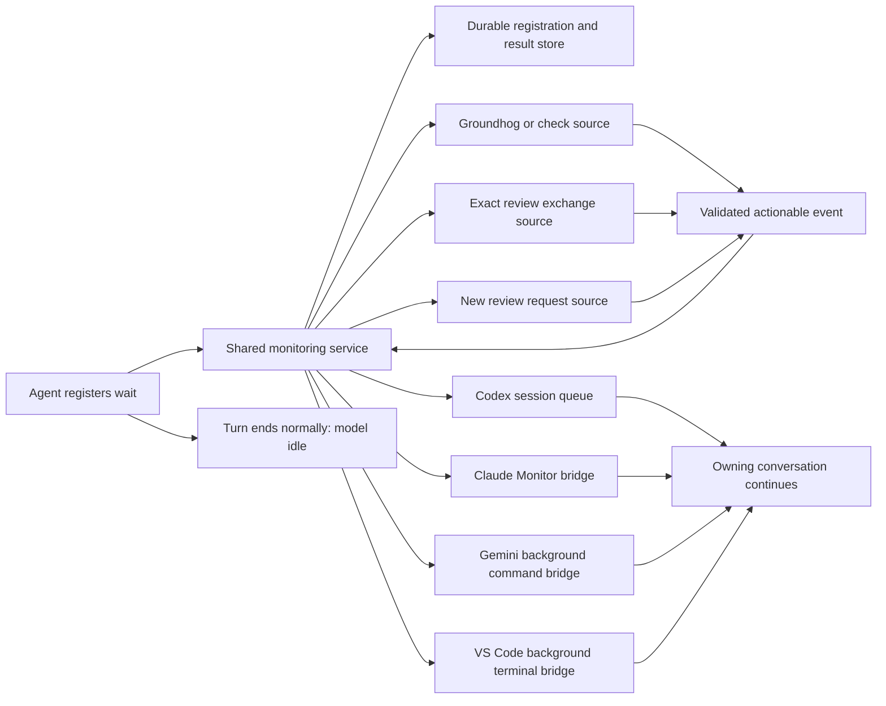

# Run one durable monitoring service

<!-- markdownlint-disable MD013 -->

- Type: Feature-request
- Status: focused child draft; awaiting human review
- Umbrella: docs/v0.13.0/draft.v0.13.0.no_polling.md
- Target version: 0.13.0
- Item slug: shared-wait-service
- Research date inherited from umbrella: 2026-09-14

## Purpose and scope

Create the shared monitoring foundation that lets an agent register a wait
and finish its turn while ordinary code monitors the source and retains the
result for delivery. The full no-polling experience uses source and host
adapters supplied by later umbrella items.

This focused draft derives only item 1 of
[Wake Me When It Matters](draft.v0.13.0.no_polling.md). It includes the settled
entry and its detail subsection, the shared constraints assigned to that
entry, and the limited Codex/Claude feasibility work needed to inform the
core interface. It is a draft for human review, not an approved requirement,
design, implementation plan, or support claim.

The core can be implemented and tested with synthetic source and host
fixtures. First, run the small Codex proof of concept below and attempt the
Claude counterpart where its session capability is available, before
substantial service implementation commits to unproven wake assumptions.
Production Groundhog/check readers, review subscriptions, host
adapters, instruction migration, and the common live proof/support framework
remain with their own umbrella items. The architecture diagram below shows
those eventual connections as context for the core interfaces.

## Selected umbrella entry

| Order | Type | Key title | Slug | Status | Requirement | Validation plan |
| --- | --- | --- | --- | --- | --- | --- |
| 1 | Feature-request | Run one durable monitoring service | `shared-wait-service` | pending | - | - |

### 1. Run one durable monitoring service

- Type: Feature-request
- Key title: Run one durable monitoring service
- Slug: `shared-wait-service`
- Earlier dependencies: none.

Regroup **Proposed shared architecture**, **Registration, delivery, and
recovery contract to develop**, **Service ownership and local tooling**, and
**Capability failures and explicit fallbacks**. Carry **Review role isolation
remains mandatory** as a constraint on registrations and event authority,
without implementing the review source here. Use the Codex and Claude research
to scope the initial feasibility probes.

This boundary establishes the one shared authority that all sources and
hosts need. The title makes durable monitoring the deliverable. It includes
the registration API, source and host interfaces, wait/result persistence,
delivery bookkeeping, local IPC, instance discovery, lifecycle, and
diagnostics. Per-session or per-wait bridges remain transport clients of that
authority.

Carry these concrete requirements and decisions into the focused work:

- Registration binds the canonical repository/worktree, exact source,
  recipient session/thread and connection incarnation, and permitted
  continuation. Retrying it must not create another logical wait.
- A successful acknowledgement means both durable registration and an armed
  usable host route. Reconcile completion before registration, before arming,
  and before the normal turn ends; do not require another source change.
- Persist the outcome before delivery. Distinguish source readiness,
  transport acceptance, and workflow consumption. Stable event identity,
  reconciliation, and idempotent consumption must cover lost acknowledgements
  without claiming arbitrary exactly-once execution.
- Define cancellation ordering, deadlines, indefinite waits, busy/closed host
  behavior, service or bridge restarts, and stale-session recovery. Cancelling
  a wait does not cancel healthy underlying work.
- Coalesce identical source watches. Use native notifications or blocking IPC
  where suitable and keep any bounded reconciliation polling in ordinary
  code. Service health, retries, and progress must not invoke a model.
- Resolve user-owned startup, hidden Windows launch, singleton enforcement,
  storage, retention, access control, protocol compatibility, and cleanup
  during design. Use the existing llm-shared launcher/environment conventions.
- Host events remain machine information even if represented as user input.
  They cannot grant permissions, supply a human review confirmation, create a
  counterpart agent, or carry arbitrary executable continuation text.

Before fixing the host interface, use bounded probes of the existing Codex
queue and Claude Monitor capability where available. Record actual host
versions, normal-idle behavior, arming constraints, and any unavailable
capability. These probes establish interface evidence, not production
adapter completion, and must not launch review counterparts.

Validate the core independently with synthetic source and host fixtures,
deterministic clocks, duplicate/missed events, early completion,
cancellation/delivery races, restart recovery, and multiple repositories.
Production check/review readers belong to items 2 and 3; production host
delivery belongs to items 4 through 6 and 9.

## The problem to solve

The historical analysis records repeated wait/status interactions carrying
large contexts despite returning almost no useful information. It reports
43.3 million wait-related input tokens on September 9 and 27.8 million on
September 10, approximately 20.0% and 23.6% of those days' input respectively.
Its example of 290 wait calls and 27.82 million input tokens corresponds to
roughly 96,000 input tokens per wait.

These are figures reported in the [earlier draft](../draft_codex_wait.md), not a
fresh benchmark. Workload varied between the days. They motivate eliminating
unnecessary model requests; they do not establish a guaranteed percentage
saving, billing reduction, or quota conversion for this proposal.

The expensive boundary is a timeout returning control to the LLM, which then
decides to wait again with the conversation supplied as input. An operating
system sleep, file notification, database check, or script retry does not
itself require inference. The design must move the entire quiet interval
across that boundary, into ordinary code.

The earlier draft explored a direct blocking MCP wait with a long tool
timeout. Such a call can avoid intermediate model requests while it remains
pending. It leaves the agent turn waiting on a tool, however. The stronger
requirement here is registration followed by normal turn completion, with a
later host event starting useful work again.

The earlier statement that a script cannot wake an ordinary Codex CLI must
also be qualified by version: the inspected Codex 0.154.0 includes a native
session queue and a background queue watcher. This creates a more direct TUI
integration candidate than making a custom App Server controller mandatory.

## What "no polling" means

The required contract is **no LLM polling**. It is not a promise that every
operating system, database, source adapter, and host implementation contains
no timer or local polling loop.

| Activity during an unchanged wait | Meets the intended contract? |
| --- | --- |
| Service waits on a process handle, file notification, or IPC subscription | Yes |
| Service periodically calls an authoritative status reader in ordinary code | Yes, with a bounded and justified cadence |
| Host checks a local queue without making a model request | Yes |
| Bridge blocks quietly while the conversation is idle | Yes |
| LLM calls `wait`, checks a status command, or narrates unchanged progress every minute | No |
| Another LLM or subagent performs those checks instead | No |
| A long direct tool call remains pending without intermediate inference | Useful separate fallback, but does not meet normal turn completion |

The intended lifecycle is:

1. The agent starts or identifies authorized work and registers a precise wait.
2. Registration succeeds durably and the host's wake route is armed.
3. The agent gives a short acknowledgement and ends its turn normally.
4. The application remains open, but the model performs no work for this wait.
5. Ordinary code detects and validates the relevant event.
6. The host receives one actionable notification and continues the owning
   conversation, which reads the result and follows its existing workflow.

Here, **stop means normal turn completion**. It does not mean pressing a
Stop/Cancel button, interrupting the agent, killing a tool, or closing the
application. Those actions can disable native wake routes. A closed host may
have a result retained for later resumption, but automatic reopening of a
closed TUI is not part of the initial compatibility claim.

"One wake" means one logical continuation for a new actionable event in the
normal case. That continuation can legitimately use several model requests
to read feedback, fix code, or run the next step. Delivery retries must be
deduplicated; exactly-once execution across arbitrary crashes must not be
claimed without a protocol that actually provides it.

Unrelated user messages and useful work may continue while a wait is armed.
Their inference is not waiting overhead. Periodic goals, scheduled prompts,
progress narration, or host automations must not recreate polling for the
registered wait.

## User scope and compatibility expectations

The primary experience is the existing `codex.exe` and `claude.exe` terminal
UI. Adopting the service should preserve those applications and their current
conversations. Codex Desktop and Claude Desktop are outside the initial scope.

Gemini means Gemini CLI. It is not installed in the available environment, so
its integration can receive documentation, source review, and simulated
adapter tests here, but cannot be declared live verified.

VS Code means its GitHub Copilot conversation using the relevant native agent
tools. The event mechanism belongs to the host, regardless of the selected
LLM. Selecting Claude inside Copilot does not expose Claude Code's Monitor;
selecting a GPT model does not turn that conversation into a Codex thread.
Limited live checks are possible with the user's available selections,
**GPT 5.6 Terra** and **Claude Sonnet 5**. Other models cannot be claimed tested.

A shared service should handle concurrent repositories, worktrees,
conversations, review roles, and wait types. The initial deployment target is
the user's Windows environment. Remote development, WSL boundaries, multiple
machines, and other operating systems need explicit capability and transport
decisions before they are advertised as supported.

## Proposed shared architecture

Use one monitoring authority per local user and machine as the initial design
candidate. It owns registrations, source subscriptions, durable results,
delivery state, and local diagnostics. It does not call a model or store a
copy of each conversation's context.



The core separates two responsibilities:

- **Source adapters** determine whether the registered condition is satisfied,
  using the existing source's authoritative semantics.
- **Host adapters** deliver a compact event through a mechanism that can
  continue the particular idle conversation.

One service does not imply one operating system process in total. Claude may
need a persistent bridge per session; Gemini and VS Code may need a quiet
background command per wait. These clients only subscribe, forward the final
event, or exit. They do not duplicate review scans or Groundhog monitoring.

Prefer native notifications and blocking IPC. Where a source needs periodic
reconciliation, perform it in the service, coalesce identical source watches,
and bound its cadence. A file observer must tolerate duplicate notifications
and missed events. Notifications are hints to read authoritative state.

The service's own logs, heartbeats, retries, and progress belong in local
diagnostics. They must not be forwarded as model-visible events merely to
prove that the service is alive. Particularly, do not stream existing review
progress JSON or Groundhog log progress into Claude Monitor or a host terminal
bridge that treats output as a reason to invoke the model.

## Registration, delivery, and recovery contract to develop

### Registration identity and acknowledgement

A registration needs enough information to bind the source to the right
recipient. Candidate fields, not a finalized wire schema, are:

| Information | Purpose |
| --- | --- |
| Wait ID and registration idempotency key | Retrying registration does not create duplicate waits |
| Source kind and canonical repository/worktree or artifact home | Resolve the intended source without relying on a daemon's working directory |
| Exact run identity or exchange identity, round, and generation | Reject completion of a different or superseded operation |
| Host kind, session/thread identity, and connection incarnation | Route to the registered conversation and detect stale bindings |
| Review role and permitted continuation | Preserve role boundaries and existing workflow authority |
| Host capability and armed delivery route | Establish that a normal turn can safely finish |
| Deadline or explicit indefinite-wait policy | Avoid treating routine adapter timeouts as work completion |
| Result and acknowledgement state | Support durable delivery and recovery |

Do not infer a conversation from the current directory, newest transcript,
active editor tab, or a fuzzy session name. Do not infer a particular run from
a reused PID alone. Where an existing source lacks a sufficiently durable run
identity, define the smallest compatible extension during design.

Registration must acknowledge that the durable record exists and that the
host route is usable. A host-managed background bridge must be established
before the agent is told it can end the turn. A persisted pending result must
also be delivered when the source completed before registration or before
the host became idle; the service must not depend on a future file change.

### Event content and trust boundary

An event should carry a stable event ID, wait ID, source identity, outcome,
bounded result data, and a reference to authoritative details. Prefer the
exact answer path or a compact check result to an entire transcript or log.
Use a stable continuation kind rather than an arbitrary shell command copied
from source content.

Host notifications are machine-generated information. They do not constitute
a new human approval, grant new permissions, or change an agent's role. This
must remain clear even if a host transport represents the notification as a
chat user message. The recipient validates the registration and resumes only
the already authorized workflow.

Keep session ownership capabilities out of user-facing messages and ordinary
logs. If source access requires one, bind it to the existing session and
protocol instead of reconstructing it from artifacts or accepting a stale
token as new authority.

### Delivery and source state must remain distinct

A possible lifecycle is registered, armed, waiting, ready, delivery pending,
delivered, and acknowledged, with cancellation, expiration, invalidation,
and operational failure represented explicitly. Design should decide which
states belong to the wait and which belong to the delivery attempt.

Persist an outcome before attempting host delivery. A successful enqueue or
bridge write means transport acceptance, not proof that the model consumed
the result. Retain enough information to reconcile a crash between sending
and recording delivery. Use stable event identity and idempotent workflow
operations to prevent repeated consumption.

If the host is busy, use its supported queue behavior and preserve ordering.
If the user cancels the wait, suppress future automatic continuation for that
registration. Cancelling monitoring must not silently terminate a healthy
check or change a review exchange. Cancelling the underlying work requires
its existing workflow semantics.

If the service or bridge restarts, recover without launching a second worker,
consuming a review twice, or repeatedly waking a host with the same failure.
If the session closes, retain the result and report delivery as pending or
unavailable. A resume policy must explicitly decide when to rebind it.

## Review role isolation remains mandatory

The shared service must preserve the boundary in
[instructions/review-requestor.md](../../instructions/review-requestor.md).
A requestor publishes through the exchange and subscribes to its own answer.
A reviewer independently subscribes to requests and publishes its answer
through the exchange. Neither role registers the other role, creates a
counterpart agent, invokes its skill, or sends it a direct wake command.

The service delivers against independently established subscriptions. A
request artifact becoming available satisfies an existing reviewer's wait;
it does not authorize a requestor to create or control that reviewer. Record
subscription provenance so a delivered event can be distinguished from an
automated counterpart trying to initiate a role.

Preserve the review protocol's ownership and claim operations. If several
reviewers are eligible, a source notification must not imply that all own the
same request. Apply existing ambiguity and claim rules; a losing claimant
must not review work it does not own. Preserve session-only capability
handling and ownership-generation fencing across waits and reconnections.

When an answer requires another round, the requestor may continue already
authorized work and register the next wait. At convergence or another human
gate, present the durable outcome and await the existing human decision.
A service event can never supply `confirm` on the human's behalf.

The implementation must reconcile the present instruction to execute a
bounded role wait with the new supported register-and-idle lifecycle. Until
that migration is implemented, this draft is not an instruction to bypass
the current workflow.

## Service ownership and local tooling

Prefer a service owned by the current user, reusable across llm-shared
consuming repositories. Starting on first use is a candidate; a Windows
service installation or administrator rights should not be assumed necessary.
Background startup must avoid opening unwanted console windows and must
survive the initiating shell call returning.

Use llm-shared's existing launcher and Python-environment conventions. A
consuming repository supplies its own resolved context; service startup must
not depend on its current directory, an interactive doskey alias, or a Python
environment belonging to some other project. See
[rules/run_commands.md](../../rules/run_commands.md).

Define instance discovery, singleton enforcement, protocol versioning,
readiness, reconnect behavior, storage location, retention, and cleanup.
Ordinary local status tools should show pending waits, delivery failures, and
the reason a host is unsupported without invoking a model. Service health
checks remain code-only.

Use a local transport with appropriate user/session access control. Named
pipes, loopback HTTP with authentication, and other local IPC are candidates.
Do not choose a direct Claude localhost WebSocket route merely because the
service uses WebSockets elsewhere. Transport choice and host compatibility
are separate decisions.

## Capability failures and explicit fallbacks

If registration or host arming fails, report that failure immediately. Never
claim an automatic wake is registered when it is only a persisted source
watch with no usable host route.

A host capability check should distinguish at least:

- Strict idle continuation supported for this session and wait type.
- Result can be retained, but automatic continuation is unavailable.
- A direct pending-tool wait is available as a separately identified fallback.
- The source or adapter is unsupported or misconfigured.

Do not silently fall back to periodic LLM checks. If the selected fallback is
manual resumption, say so and retain the result. If it is a direct blocking
tool, expose its finite timeout and pending-turn behavior. A timeout must not
be disguised as successful completion or automatically recreate a short
model polling cycle.

Do not weaken the user's global approval, telemetry, or provider settings to
make a capability probe pass. Resolve routine adapter setup within the
authorized environment and report an actual unsupported condition precisely.

## Initial Codex and Claude proofs of concept

These probes belong to core contract discovery, before substantial
implementation fixes assumptions about registration, arming, event identity,
or delivery acknowledgement. They use the existing host mechanisms where
available; they do not implement the later production adapters.

### Sequence and smallest useful prototype

Prove the Codex wake primitive first, then attempt the Claude equivalent in
an independently available Claude Code session. Do this before building the
complete cross-host durable service or freezing its host interface. A queue
command's successful exit or Monitor appearing in a tool list is insufficient.

Use a small ordinary-code harness with one persisted synthetic registration,
one result, and one delivery record. Record the exact recipient, wait ID,
stable event ID, due condition, result reference, and attempt/consumption
state. This temporary harness stands in for the future service; its storage
and transport are experiment choices, not the production design. Reuse its
source fixture and evidence format for both hosts, with only delivery varying.

The harness and evidence collector must survive the initiating tool call
returning. They own all timers, observation, and timeout handling. Neither the
waiting conversation nor another LLM may supervise the quiet interval through
repeated tool waits or status calls. Keep their output in local evidence
files until the one actionable event is ready.

Use a ten-minute unchanged-source baseline after confirmed normal turn
completion. Establish that boundary from a verified host lifecycle record
or an independent operator marker outside the conversation; starting a timer
at registration alone does not prove ten idle minutes. Set a bounded delivery
and duplicate-observation window before the run and record the actual times.
The race/recovery cases below may use shorter controlled intervals once this
baseline is established. The four-minute A/B trials below measure comparative
cost; they do not replace this ten-minute idle-continuation check.

### Codex probe inputs and limits

The umbrella inspected Codex 0.154.0. Validate executable discovery, the
exact owning thread UUID, its storage/profile context, and the availability
and binding of `CODEX_THREAD_ID`. The research did not resolve `codex` on
PATH and used the installed executable's full path.

The native queue command is a candidate separate-process writer. This shape
is inherited research, not a command executed while deriving this draft:

```text
codex queue --thread <registered-thread-uuid> --message "Machine event: wait_id=w17 event_id=e17. Read the registered result and resume the authorized workflow."
```

Test a normally idle ordinary TUI, distinguishing it from an interrupted
thread. The inspected queue watcher checks SQLite every ten seconds without
inference; that timer is compatible with the no-LLM-polling contract and is
not a guaranteed delivery deadline. Each CLI invocation creates a fresh
client ID, so collect evidence for the core's retry and acknowledgement
contract without assuming CLI retries are idempotent.

See the pinned [queue command](https://github.com/openai/codex/blob/rust-v0.154.0/codex-rs/cli/src/queue_cmd.rs)
and [queue service](https://github.com/openai/codex/blob/rust-v0.154.0/codex-rs/ext/queue/src/service.rs).
Upstream tests were inspected, not run in the research.

The optional App Server route must bind the relevant thread and the backend
that owns or loads it. Starting an unrelated server, adding context, or
steering an active turn does not by itself establish idle continuation.
Retain that interface constraint; the complete App Server alternative and
its protocol example belong to the later Codex item.

### Codex PoC procedure

1. Use an ordinary `codex.exe` TUI conversation with its exact thread UUID,
   resolved executable, and matching storage/profile context. Preserve its
   selected model and permissions. Bind the telemetry source to that UUID;
   do not choose a session by recency or directory alone.
2. Inspect the installed version's rollout/request telemetry and identify
   what records actual model requests, normal turn completion, and token
   usage. Record a baseline and any coverage limitations. The collector must
   observe locally without calling a model or copying conversation contents
   into the harness's registration store.
3. Register the synthetic wait in the harness and establish a usable queue
   delivery route. Return its acknowledgement promptly. The agent then
   acknowledges the wait and ends its turn normally, leaving the TUI open.
   No direct tool wait should remain pending in that turn.
4. Hold the source unchanged for ten minutes after that turn-completion
   boundary. Use the separate collector to verify no wait-induced model
   requests and no attributable token-usage advances. In this baseline, send
   no unrelated prompts; test busy-thread behavior separately.
5. Have the ordinary harness persist the synthetic result and execute the
   `codex queue` command shown above once, using the exact registered thread.
   Include the stable event ID and a bounded result reference in the final
   message. Record enqueue time, exit status, and any transport receipt.
6. Observe whether the same idle TUI automatically starts useful work without
   an Enter key, new human prompt, manual resume, or replacement session. Its
   preauthorized continuation reads the fixture result and records consumption
   of that event ID once, then ends normally. A message merely waiting for the
   next human prompt fails the automatic-continuation criterion.
7. Keep the ordinary collector active through the bounded observation window.
   Correlate event delivery, the host turn, and the consumption record. Count
   one logical continuation in this trial; it may contain several useful
   model requests. Record any extra wake and repeat the cases below before
   drawing conclusions about races or restart recovery.

This experiment tests the existing TUI queue route. It neither starts an
unrelated App Server nor launches `codex exec` as a substitute conversation.
If the route cannot wake this normally idle TUI, record the failure and
revisit that dependency before implementing service behavior that assumes it.

### Claude probe inputs and limits

The umbrella checked Claude Code 2.1.270 version/help. That does not prove
that Monitor is exposed in the running session. Verify availability and the
actual schema, Windows command launch, silent persistence, event delivery to
the same normally idle conversation, cancellation, and bridge failure.

The documented Monitor follows Bash command permissions, is unavailable on
Bedrock, Google Cloud's Agent Platform, and Microsoft Foundry, and is
disabled by `DISABLE_TELEMETRY` or
`CLAUDE_CODE_DISABLE_NONESSENTIAL_TRAFFIC`. Do not change those settings just
to make a probe pass.

The documented WebSocket mode requires v2.1.195 or later and rejects
private/local destinations. Use a Monitor command with appropriate local
IPC as the candidate bridge; do not assume direct localhost WebSocket
delivery. Keep the bridge silent until one actionable outcome and put
diagnostics elsewhere. See the official
[Monitor reference](https://code.claude.com/docs/en/tools-reference#monitor-tool).

Plugin startup/packaging and production persistent-bridge behavior belong
to the Claude adapter item. An unavailable Monitor or an unverified fallback
must be recorded as a capability limit, not treated as a successful probe.

### Claude PoC procedure

1. Use an independently available ordinary `claude.exe` conversation. Record
   version, provider, selected model, permissions, and whether Monitor is
   actually callable there. If it is unavailable, record that limitation and
   stop this host's live probe without changing provider or telemetry settings.
2. In that conversation, use the exposed Monitor schema to start a command
   bridge connected to the same synthetic harness. Confirm both the durable
   registration and an armed subscription before acknowledging success. The
   bridge must remain silent until a result; do not assume a localhost
   WebSocket route or invent Monitor arguments from another version.
3. End the agent turn normally with the TUI open. Verify Monitor's background
   subscription survives that completed turn. A foreground tool call that
   remains pending for ten minutes does not satisfy this PoC.
4. Hold the synthetic source unchanged for ten minutes after normal turn
   completion. Collect available request/usage evidence through ordinary code.
   Keep diagnostics, progress, and heartbeat output away from any channel
   Monitor could present to the model.
5. Persist the result in the harness and publish one compact event through the
   armed bridge. Observe whether it triggers useful work in that same idle
   conversation without a new human prompt. The preauthorized continuation
   reads the result and records the stable event ID as consumed once.
6. Observe the bounded post-delivery window, then repeat early-event,
   busy-conversation, restart, cancellation, and bridge-failure cases below.
   Record whether bridge exit produces an additional host event or disables
   later delivery. Clean up the subscription and harness through ordinary
   code after the trial; do not leave an accidental recurring wake source.

If Monitor works but suitable request telemetry is unavailable, report the
observed wake separately from the unverified zero-request claim. A successful
Codex probe does not validate Claude, and an unavailable Claude capability
does not invalidate evidence already obtained for Codex.

### PoC race and recovery cases

Run these against each available host after its baseline. Restart the small
harness as the stand-in for a future service restart; this does not establish
that the production service, which does not exist yet, has been tested.

| Case | Evidence sought |
| --- | --- |
| Result exists before registration or host arming | Reconciliation delivers the retained result without requiring another source change |
| Result arrives after arming but before the registering turn ends | Capture actual host ordering; the result is retained and consumed without another human prompt |
| Result arrives during unrelated useful work | Preserve the recipient and record queue/interruption behavior; attribute that work's requests separately from waiting overhead |
| Harness restarts with a pending wait or ready undelivered result | Reload the persisted identity and deliver without losing the result or starting a second worker |
| Delivery is accepted but its acknowledgement is lost | Record retry behavior using the same logical event ID; expose duplicate host wakes separately from deduplicated consumption |
| Wait is cancelled, bridge fails, or TUI is interrupted/closed | Record route failure and retained-result state; no replacement agent or periodic model retry loop |

For restart and lost-acknowledgement trials, record what the minimal harness
actually implements. A no-duplicate result in one trial is not proof of
exactly-once behavior across crashes. Codex's fresh CLI client IDs are a
specific reason to investigate that gap rather than assume it away.

### Evidence to retain from the probes

Record host versions/configuration, session binding, the arming sequence,
normal-idle behavior, event identity, timing, available request telemetry,
and any unavailable capability. Distinguish a visible notification, context
queued for a future prompt, and actual automatic continuation.

Retain the harness/collector scripts, exact invocation and relevant redacted
configuration, and a compact run report beside the effort documents when the
PoCs are implemented. Reference local raw evidence without publishing full
rollouts or credentials. Include registration, arming, normal turn end, quiet
interval start/end, source readiness, send/receipt, and consumption timestamps;
request and token deltas; logical wake count; and each case's outcome.

Before interpreting zero events, verify that the collector covers actual
requests for this host/version and spans the whole interval. Unchanged token
counters alone do not rule out failed, unmetered, or unrecorded requests.
Buffered usage updates must be correlated with request times where possible.
If coverage or attribution cannot be established, record the measurement as
inconclusive rather than equating missing data with zero model activity.

| PoC outcome | Consequence for the service work |
| --- | --- |
| Passed for the measured cases | Use the observed binding, arming, and delivery behavior to inform the core interface; retain the version and scenario limits |
| Failed | Resolve the wake or lifecycle failure before relying on that route in substantial implementation |
| Capability unavailable | Record the exact missing host capability; make no support claim for that route |
| Measurement inconclusive | Preserve any observed wake evidence, but leave zero-request validation open |

Close this feasibility checkpoint with an explicit finding for each host and
an account of unresolved interface assumptions. Independent core fixture work
may proceed, but do not treat an unavailable or inconclusive route as proven
to justify freezing the cross-host contract. These results are engineering
evidence, not a new human approval or completion of the later adapter items.

Use cheap synthetic outcomes and independently authorized sessions. Never
launch a reviewer/requestor counterpart to test a wake. Preserve the user's
chosen model, permissions, and conversation. These probes inform the core
interface; production host support remains subject to the later adapter
items and their live evidence.

## Controlled A/B measurement

Measure the cost of repeated context submission with matched, substantial
contexts. Use classic polling as the control and distinguish the prototype
from the actual shared service in every report:

| Arm | Mechanism | What the result establishes |
| --- | --- | --- |
| A: classic | Foreground synthetic work followed by model-driven waits; no shared monitoring or host wake route | Cost of the controlled polling pattern on this host/version/context |
| B-prototype | Small ordinary-code harness and native host wake primitive | Feasibility and preliminary cost of register-and-idle before the service exists |
| B-service | Actual shared monitoring service, durable registration, armed host route, and the same synthetic condition | Observed behavior and cost with the centralized service in use |

First compare A with B-prototype during core discovery. Repeat fresh matched
A/B-service trials once the shared core and relevant host route are available.
A prototype result must never be relabelled as a service result. This item
defines the measurement and owns the initial probes; production integration
and the common support evidence still belong to their later umbrella items.

### Matched context and experimental controls

Use a fresh conversation for every trial, including every repetition. Pair
sessions with the same host build, model, reasoning settings, context-limit
and compaction configuration, repository/worktree, instructions, permissions,
and tool inventory except for the necessary wait integration. Record those
integration differences. Preserve the user's selected model; no benchmark
requires changing it or spawning an automated review counterpart.

Freeze both draft files at one revision and record their hashes. Seed each
session with the following prompt before collecting benchmark costs:

```text
Read these two files completely and keep their contents in context for the next task:

- docs/v0.13.0/draft.v0.13.0.no_polling.md
- docs/v0.13.0/draft.v0.13.0.shared-wait-service.md

Do not analyze or summarize them yet. When finished, reply exactly:

READY
```

Verify the reads were complete and record any truncation or compaction.
`READY` alone does not prove equivalent retained context. Record input usage
for the final seed response and first measured request where available.
Choose a context-matching tolerance before testing, for example 5%, and flag
or repeat materially unmatched pairs. Record the observed size rather than
assuming these files create 70K tokens. Keep the seed comfortably within the
configured context window and avoid changing the documents between arms.

Exclude seeding from the primary benchmark totals and report its cost
separately. Include the benchmark prompt, registration/startup, acknowledgement,
waiting, delivery, result validation, and final response in the end-to-end
totals. Preserve the natural additional context from A's repeated waits;
that growth is part of the behavior being measured.

Run the trials sequentially, with no unrelated user prompts, goals, scheduled
work, or other agent activity in the measured conversation. Avoid other active
Codex sessions in that repository during a trial where practical, but always
select evidence by exact thread ID. Repository location alone is not identity.

### Timer fixture and measurement boundaries

Use a test-only synthetic condition with a nominal duration of 240 seconds.
A foreground sleep/completion fixture supplies A; an equivalent timer or
completion source supplies B. Prefer a shared fixture definition and record
any source implementation differences. No Groundhog walk, real review, or
production timer feature is required to measure waiting overhead.

The source becomes eligible after its 240-second delay; operating-system
scheduling and host delivery add latency. Record actual timestamps instead
of claiming exact wall-clock delivery. In A the source clock starts when the
fixture starts; in B it starts at the recorded registration/source-start
boundary. Keep the duration and clock-origin rule explicit for each arm.

Create a unique run manifest from an independent ordinary process after
`READY`, immediately before submitting the benchmark prompt. Store run/pair
ID, arm, exact thread ID and rollout location, seed hashes, configuration,
source identity, and baseline counters/file positions. Use separate files per
run rather than one reusable temporary start marker. Record UTC timestamps
for correlation and monotonic durations where the collector can supply them.

| Boundary or interval | Measurement purpose |
| --- | --- |
| Benchmark start to final `WAIT_TEST_DONE` turn completion | End-to-end cost, including prompt, setup, waiting, and useful continuation |
| Source start to authoritative readiness | Actual synthetic workload duration; nominally 240 seconds in both arms |
| A's first pending execution return to source readiness | Interval in which the model repeatedly learns that work is unchanged |
| B's normal registering-turn completion to source readiness | Strict quiet interval, after durable registration and host arming |
| Source readiness to first useful continuation | Delivery/resumption latency |
| Final turn completion to predeclared observation-window end | Detect late duplicate wakes and delayed telemetry separately |

B's setup consumes some of a timer started at registration. Therefore a
240-second source interval does not automatically contain 240 idle seconds.
Report actual quiet durations and setup time for both arms. The separate
ten-minute PoC deliberately starts its quiet clock after normal turn completion.
If comparing equal-length quiet intervals, arrange that source release in
ordinary code for both arms and declare the changed protocol in advance.

Record the end marker when the final response's turn completes, not when an
operator eventually launches analysis. Identify the final assistant response
and its host turn: the same sentinel in fixture stdout, quoted seed content,
or a tool result is not that boundary. Allow buffered evidence to settle
through the bounded observation window and correlate it to the original
request times. All marking, collection, and analysis run outside the measured
conversation without periodically invoking it.

### Collector requirements and limits of the supplied one-liner

Adapt the proposed PowerShell analysis into a standalone script with explicit
run-manifest and output paths. Follow `rules/run_commands.md`: use a `.ps1`
file for multi-statement PowerShell and a simple `-File` invocation. Do not
copy the nested CMD/PowerShell quoting or scan every repository session each
time. This draft specifies the collector; it does not claim that script exists.

The collector must:

- Resolve the exact recorded thread and its actual profile/storage location;
  verify metadata before reading its rollout files. Do not assume a default
  `.codex` directory, select the newest file, or combine sessions by cwd.
- Read enough pre-start history to establish cumulative-usage baselines and
  event identity, then restrict accounting to the recorded start/end windows.
  A first `token_count` after the marker may repeat earlier usage; starting
  its previous counter at `-1` would risk counting seed work again.
- Verify the installed telemetry schema and distinguish model request/attempt
  records from usage reports. Deduplicate repeated reports and handle counter
  resets, compaction, retries, rotated files, delayed writes, and partial JSONL
  lines explicitly. Never silently discard malformed evidence and report zero.
- Prefer request identities and lifecycle timing for request counts. If only
  usage-bearing completions are visible, label that count as such, rather than
  asserting it includes every model request, failed attempt, or retry.
- Reconcile per-request usage with compatible cumulative deltas, avoiding
  double counting `last_token_usage` and `total_token_usage`. Preserve unknown
  values as unknown. Check the schema's cached-input semantics before deriving
  uncached input or percentages, and report reasoning usage separately when
  available rather than assuming it can be added to output without overlap.
- Correlate requests, tool call IDs/results, host turns, and source readiness.
  A single `$pending` tool name cannot reliably associate later token reports
  with multiple or nested calls. Recognize the host's actual execution/wait
  tools, including orchestration wrappers; do not require a literal `wait` name.
- Count status-only or wait-induced requests regardless of their tool name.
  Separate unchanged-work polling from the useful continuation that receives
  the terminal result. Flag a request crossing a phase boundary or otherwise
  ambiguous attribution rather than forcing it into a convenient bucket.
- Detect gaps, lost evidence, unexpected threads, unrelated inference, and
  compaction during measurement. Report these conditions and any exclusions.
  Keep raw evidence locally and publish bounded, redacted reports.

Check the collector with small known event fixtures before using its totals:
pre-start usage repeated after the marker, duplicate reports, missing request
telemetry, counter reset/compaction, delayed usage, nested calls, and unrelated
thread records. These validate measurement correctness; they require no LLM
calls or real timer sleeps.

### A: controlled classic-polling prompt

Use this as a benchmark template after resolving the actual host tool names
and supported wait parameters. Its deliberate polling exception applies only
to the benchmark when run, not to this draft-editing task or normal workflows.

```text
This is a controlled benchmark of classic polling. Do only this work:

1. Start the prepared 240-second synthetic completion fixture as one foreground
   execution. It produces WAIT_TEST_DONE when complete. Use the prepared project
   launcher/environment and keep the exact execution identity.
2. Make the initial execution yield after 1000 ms if the host permits it.
   Otherwise use its shortest supported value and record that actual value.
3. While that execution is active, use this host's normal built-in mechanism
   to wait for that exact execution, requesting 60000 ms each time.
4. After each pending return, issue the next wait until the same execution
   completes. Do not restart or duplicate it.
5. Do not use the shared service, queue, MCP monitor, detached execution,
   another agent, status commands, progress narration, or unrelated work.
6. After successful completion, reply exactly WAIT_TEST_DONE.

For this controlled trial only, the explicit polling cadence overrides the
usual preference to avoid frequent polling, within the host's tool limits.
```

The fixture may implement the proposed `time.sleep(240)` and completion print,
using the repository's launcher conventions. Do not assume `python` is on
PATH. Record actual execution yields and wait durations; unsupported tool
parameters are a protocol deviation, not permission to invent another tool.
Expect several polling returns, but measure their number rather than enforcing
exactly four. A return carrying completion belongs to useful resumption.

### B: shared-service prompt and prototype variant

```text
This is a controlled benchmark of the shared no-polling wait mechanism.
Do only this work:

1. Register one prepared 240-second synthetic wait with the shared service.
   Record the wait identity and the agreed source-clock start/due condition.
2. Bind it to this exact conversation and establish the supported wake route.
3. Obtain the acknowledgement that both durable registration and host arming
   succeeded. If either fails, report failure rather than claiming success.
4. Acknowledge registration briefly and finish this turn normally.
5. Do not call wait or status tools, sleep in a pending foreground tool,
   narrate progress, launch another agent, or perform model-driven polling.
6. Leave monitoring and event delivery to the shared service's ordinary code.
7. When the event automatically resumes this conversation, validate the wait
   and event identity, read the synthetic result, record consumption once,
   and reply exactly WAIT_TEST_DONE on success.
```

For B-prototype, replace the service with the small PoC harness and label the
run accordingly. For B-service, require evidence of the actual shared service
instance, registration, source readiness, and delivery record. A separate
script directly enqueuing a timed event establishes only B-prototype.

Do not start another host session or require a human prompt to deliver the
result. A missing automatic wake, failed registration, or unavailable route
is a failed/unavailable trial even if it consumed zero tokens while idle.

### Metrics, repetitions, and interpretation

Report exact counts alongside convenient million/thousand-token displays:

| Metric | Interpretation |
| --- | --- |
| Verified request attempts and usage-bearing completions | Keep distinct when telemetry covers only one of them |
| Quiet-interval wait-induced requests and input tokens | Primary no-polling evidence, covering all tool names and status-only reasoning |
| `Wait_calls`, `Wait_requests`, `Wait_input_M`, `Wait_avg_K` | Secondary diagnostics with an explicit attribution rule; unknown if evidence cannot support it |
| `NonWait_requests`, `NonWait_input_M` | Complementary diagnostics, not automatic proof that this work was useful |
| End-to-end input, cached input, uncached input, output, and available reasoning usage | Total cost of the measured task, with schema semantics and cache ratio recorded |
| Setup/registration, quiet-wait, and useful-continuation subtotals | Expose the cost of registration and resumption instead of hiding it in a zero-wait claim |
| Source/quiet durations, delivery latency, logical wakes, and consumption count | Establish usable continuation and detect duplicate behavior |
| Compactions, retries, deviations, and telemetry gaps | Explain uncertainty and whether a matched comparison remains valid |

For B, the intended quiet result is zero wait-induced model requests and zero
repeated input submissions, with zero wait-tool calls. `Wait_input_M = 0`
alone is insufficient: a status tool or an incorrectly classified request
could still replay the context. Conversely, registration and useful work
after readiness may use several requests and nonzero input in a valid trial.

Run at least three fresh trials per arm in matched pairs, counterbalancing
order, for example `A B`, `B A`, `A B`. Apply this separately to the prototype
and service comparisons. Keep every result, including failed wakes and
inconclusive telemetry; label exclusions and repeat invalid pairs without
silently selecting only successful runs. Record cache state as observed;
fresh sessions do not guarantee identical caching. Flag compaction and
context mismatch, and retain those records when repeating a controlled pair.

Publish each pair's raw counts, input-size comparison, and end-to-end and
quiet-interval deltas, followed by a median and range. State separately the
number of tested, valid, passed, failed, and inconclusive trials. Normalize by
observed quiet duration only as a supplemental comparison; it must not conceal
different timing or missing inference evidence.

For illustration only, four unchanged-wait requests each carrying 70K input
tokens would replay about 280K input tokens. Neither that context size nor
that request count is a target or prediction. Report observed savings and
registration/resumption overhead; do not convert them into billing or quota
savings without the relevant metering evidence.

The supported conclusion should state the exact scope: during the recorded
unchanged-source/quiet intervals, A generated N attributable requests and X
input tokens, while the tested B route generated its measured counts and
automatically continued the correct conversation. Claim zero only with
adequate request coverage, and name whether B used the prototype or service.

Apply the same pairing, seed, time boundaries, and reporting to Claude when
its Monitor capability and telemetry permit it. Use Claude's actual tool and
request schema; do not reuse the Codex JSONL parser or assume a tool named
`wait` exists. Compare A versus B within the same Claude model/configuration,
and keep its findings separate from Codex's. Unavailable Monitor or incomplete
telemetry remains an explicit limitation.

## Core acceptance and validation

The following quiet-wait criterion is inherited from the umbrella. Core
fixtures must establish durable registration, quiet monitoring, and correct
delivery/lifecycle behavior without model requests. Bounded host probes
inform whether the interfaces can support normal turn completion. Full
production source/host integration and cross-host support claims remain with
the later items; this core draft does not claim them from fixture results.

### Primary quiet-wait criterion

For an isolated supported conversation, register a wait and let the LLM finish
normally. Keep the source unchanged for a meaningful interval, for example
ten minutes, longer than several cycles of the former one-minute polling.
During that interval, demonstrate:

- No wait-induced model requests, repeated context submissions, status-only
  reasoning, tool polling, or progress narration.
- The service and any bridge remain healthy using only ordinary code.
- The original conversation is idle and remains usable by the user.
- A meaningful source transition triggers one logical automatic continuation
  in that conversation, carrying the correct outcome and identity.

Measure actual model request activity where the host exposes it. A quiet UI,
an absence of `wait` tool calls, or a process still running is not sufficient
evidence. If request telemetry is unavailable, report that verification gap.

Registration, the final acknowledgement, and useful work after the event can
consume tokens. The criterion concerns the intervening unchanged wait.
Do not conflate cached input with zero requests or infer financial savings
from token counts without the relevant metering evidence.

### Core lifecycle scenarios

Use synthetic source and host fixtures to exercise the following inherited
scenarios. Source adapters will later supply the authoritative domain
predicates; the core must preserve their identity, typed outcomes, and
delivery lifecycle.

| Scenario | Expected result |
| --- | --- |
| Source finishes before subscription or turn completion | Result remains deliverable without another source change |
| File notifications repeat or are missed | Reconcile state without duplicate workflow consumption |
| Host is busy with unrelated useful work | Queue according to supported host semantics; preserve recipient |
| Wait is cancelled while completion is racing | Apply explicit ordering; no unauthorized late continuation |
| Service or bridge restarts | Recover registrations and pending delivery without duplicate workers |
| Delivery succeeds but acknowledgement is lost | Reconcile using event identity; do not assume exactly-once delivery |
| Host closes or is interrupted | Preserve result and report route state; do not create a new agent silently |
| Deadline expires or monitoring fails | One typed operational outcome; no recurring status-only wake loop |
| Several hosts watch the same source | Share monitoring; deliver only according to each valid subscription |
| Another repository has similarly named artifacts | No cross-repository or cross-session delivery |

Also check registration idempotency, rejection of stale session bindings,
distinct waits sharing one source watch, readiness before arming, and the
difference between transport acceptance and workflow consumption. Retain
machine-event provenance so no delivered event becomes a human approval.

Use deterministic clocks and synthetic source events for automated tests.
Exercise races, retries, ownership boundaries, and incorrect recipients
without network inference or real sleeps. Use cheap synthetic commands and
temporary protocol fixtures for probes; a full `check.bat` or Groundhog
walk is unnecessary merely to test a completion signal.

Bound real-host probes and record versions, configuration, wait duration,
event timestamps, available request counts, result identity, and limitations.
A quiet UI alone is insufficient evidence. Do not create automated review
counterpart sessions; protocol fixtures can exercise the relevant states
without an LLM reviewer.

## Decisions still open for the core

The source proposes interfaces and behaviors, not a finalized wire schema,
storage engine, transport, or deployment plan. Resolve these choices in the
focused requirement and design:

- Service lifetime and ownership: on-demand per-user daemon, explicit
  startup, or another deployment consistent with the existing TUI use.
- Local IPC, access control, singleton discovery, durable storage, retention,
  cleanup, and protocol compatibility across clients and service versions.
- Registration identity and the arming handshake, including sources that
  complete before the host becomes idle and stale connection incarnations.
- The separation of wait state, delivery attempts, transport acceptance, and
  workflow acknowledgement, including reconciliation after a lost reply.
- Cancellation ordering, deadlines, indefinite review waits, pending results
  after host closure, and explicit session-resume/rebinding policy.
- The deduplication guarantee supported by host capabilities, including
  Codex's fresh CLI client IDs, without claiming arbitrary exactly-once
  execution across crashes.
- How a capability check distinguishes strict idle continuation, durable
  manual resumption, a separately identified pending-tool fallback, and
  unsupported or misconfigured routes.
- Monitoring/reconciliation cadence where native source notifications need a
  fallback, while coalescing watches and keeping all routine activity in code.
- Whether remote development, WSL, other operating systems, or multi-machine
  routing belongs to later scope; initial compatibility is the user's local
  Windows environment.

Source-specific extensions to Groundhog run identity belong to the check
item. Production Codex App Server selection, Claude plugin packaging, Gemini
configuration/lifetime validation, and Copilot terminal integration belong
to their host items. Their eventual requirements must implement the shared
contract rather than create separate monitoring authorities.

## Research provenance and implementation status

Repository findings come from the historical draft and the linked current
Groundhog, review, workflow, and artifact-convention files. Host findings
combine official documentation with pinned upstream implementation paths.
Documentation was consulted on 2026-09-14; versioned source links provide
reproducible anchors where available.

Local research checked Codex 0.154.0 and Claude Code 2.1.270 versions/help,
Codex's exposed queue/App Server command surfaces, the presence of a thread
identifier in the tool environment, and a limited daemon endpoint probe.
Upstream Codex queue tests were read, not executed. Gemini v0.59.0 and VS Code
1.137.0 are inspected source versions, not locally live-verified adapters.

No shared monitoring service or host adapter has been implemented by this
draft. The Codex and Claude PoC procedures above have been specified, not run.
The A/B protocol and collector requirements are also specified only; no
benchmark, collector implementation, or service-backed measurement was run
while revising this draft.
No live completion was queued into the user's conversation, no review
counterpart was invoked, and no end-to-end token saving has been measured.
The proposed routes should be promoted from research findings to supported
capabilities only with the validation evidence described above.
