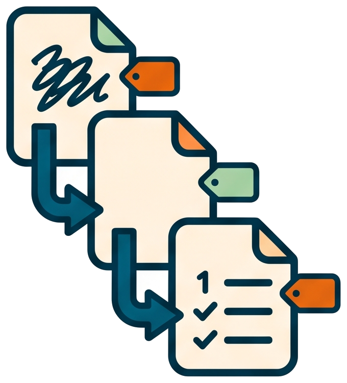

# Why documents come before code

<!-- markdownlint-disable MD013 -->

## Invocation model

The user supplies the initial intent and starts the document workflow. The AI
normally invokes the writing, review, consolidation, and handoff skills in
sequence. Invoke one writing skill directly only to enter or repeat that phase.

📝 llm-shared exists to prevent one habit: vibe-coding — "I got an idea,
here it is, now generate me some code for it, I will figure out the
details later". The workflow keeps the creative expression of the idea
while refusing to short-circuit it into code.

## 💰 What each phase buys

Each phase draws a line the model is not allowed to cross:

- **Define** — `/write-requirement` and the review loop force the need
  into plain text first. Contradictions and untestable criteria surface
  here, where changing a sentence is free.
- **Design** — `/write-design` pins the scope, the constraints and the
  acceptance scenarios before any file is named. The acceptance cases are
  the contract the last plan step will test.
- **Plan** — `/write-plans` turns the design into numbered steps, and the
  review loop runs on the plan itself. The first step adds gate tests
  that fail on purpose; the following steps make them pass one by one;
  the last step adds the acceptance tests that close the loop on the
  original requirement.

The short path exists: when the draft is genuinely one self-contained
requirement, `/write-requirement` is called directly and the split step
is skipped. The phases are a discipline, not a ceremony.

## 🐾 The trail the workflow leaves

Each phase produces an artifact — the draft, the requirement with its
decision table, the design with its acceptance scenarios, the plan and
its validation companion, the per-step grouped commits — and each merge
keeps a conventional message tying them together.

That trail serves two readers. The human returning to old code finds not
just what changed but why it looks the way it does. And an LLM asked to
extend, debug or explain that code in a future session gets the context
it needs from the repository itself: the history carries the reasoning,
not just the result.

## 🏷️ Why versions live in every filename

Every artifact carries the `vX.Y.Z` slug of its effort:
`docs\design.v0.9.0.handoff_automation.md` names its version, its phase
and its topic at a glance. Two efforts never collide, and the release
preparation can find every document the merged branch carried — that is
what the merge reword reads.

## 👉 Where to look next

- [From draft note to settled requirement](../tutorials/02-from-draft-to-settled-requirement.md)
  to walk the first phase.
- [Why the LLM reviews its own work](why-the-llm-reviews-its-own-work.md)
  for the loop that keeps each phase honest.
