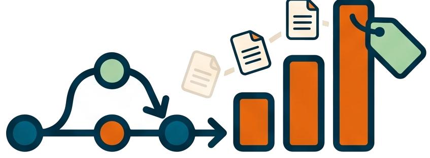
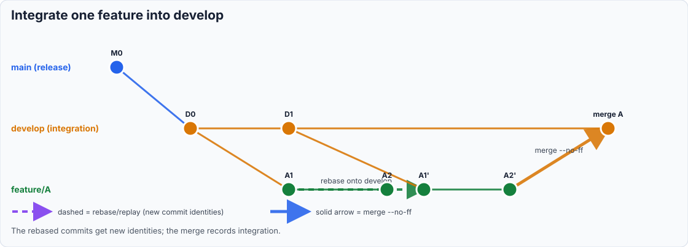
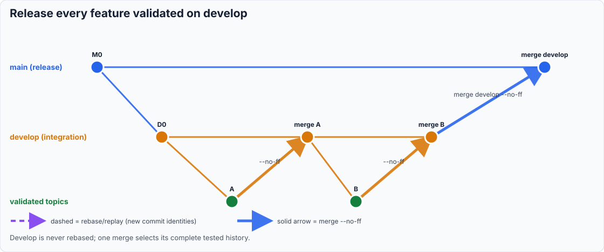

# Why release branch roles matter

<!-- markdownlint-disable MD013 -->

## Invocation model

The user starts `prepare-release` and states what should ship. The AI owns
topology detection, planner calls, conflict previews, and supported Git
operations. Call the planner directly only for read-only diagnosis or planner
development; it does not replace the release skill's approvals and follow-up.

📊 A branch name is not merely a location for `/prepare-release`. It states
which content the author is selecting.

## The model is gitworkflow, one word

The branch-role model in `prepare-release` comes from
[gitworkflow](https://git-scm.com/docs/gitworkflows), the workflow documented
for the Git project itself, and the
[task-oriented gitworkflow primer](https://github.com/rocketraman/gitworkflow).
This is not a spelling variant of generic “Git flow,” and it is not Vincent
Driessen's GitFlow branching model. The distinction matters because the two
models answer “what may enter the next release?” differently.

Gitworkflow treats a feature as a first-class *topic*. A topic can be merged
into an integration branch such as `next` for combined testing without being
committed to `master`. When it is stable enough, that same topic graduates by
being merged independently into `master`. Git's documentation recommends
forking it from the oldest integration branch it may eventually enter, and
warns that a topic already merged elsewhere should not itself be rebased.

The roles used here are therefore:

| `prepare-release` | gitworkflow role | Meaning |
| --- | --- | --- |
| `main` | `master` | Topics accepted for the next release |
| feature branch | topic branch | One independently selectable unit of work |
| branch named by an umbrella slug | topic-specific `next` | Collection topics tested together before the next umbrella row |
| `develop` | approximately `next` | Several topics tested together before release selection |

The approximation is deliberate. Canonical gitworkflow makes early
integration branches throw-away or rebuildable and normally never merges
`next` wholesale into `master`. This skill also supports repositories where
`develop` is the published, long-lived hosting default and `main` is reserved
for preparing and tagging releases.

## The prepare-release variant

The common idea is that a topic first enters the earliest stability branch it
needs. Invoking `prepare-release` from a feature therefore finishes continuous
integration first:

1. resolve the feature's umbrella before topology planning; its normalized slug
   names the collection's integration branch;
2. replay only the confirmed feature range onto that branch when needed, using
   a temporary landing branch so the original ref is not rewritten;
3. merge it there with `--no-ff` and reword that merge;
4. inspect the feature's umbrella table before deciding whether release work
   may begin.

When another ordered requirement is pending, the run stops there. This is not
an incomplete release: integration of one topic is the intended result, and
`pw skill --after-merge` supplies the next `process-draft` command. When every
umbrella row is complete, its integration branch is promoted to main. An
umbrella topic never falls back to main merely because no generic `develop`
branch exists. Only a standalone topic with no generic integration branch uses
main as its first destination.

| Common with gitworkflow | Different in this variant |
| --- | --- |
| Features/topics are first-class integration units | `develop` is a long-lived default branch rather than a rebuildable `next` |
| Integration testing does not automatically start release artifacts | A canonical umbrella table decides whether another topic comes next |
| `--no-ff` merge commits preserve each integration decision | Temporary landing branches protect published feature refs during replay |
| Release and integration remain separate stability levels | Develop is merged wholesale to main when every umbrella row is complete |

This motivation and its contrast with GitFlow are developed in the cited
Stack Overflow answers about
[test versus production integration](https://stackoverflow.com/a/44470240/6309),
[selecting production features](https://stackoverflow.com/a/216228/6309), and
[independent feature deployment](https://stackoverflow.com/a/53405887/6309).

## Integration is a release train

A long-lived branch such as develop accumulates features after they pass their
individual validation. Starting the release there means every integrated
commit is wanted. One non-fast-forward merge into main preserves that shared
history and creates a visible release boundary. This is an intentional bulk
optimization for the “all topics are ready” case, not canonical
gitworkflow's normal path.

Rebasing develop would rewrite a branch other contributors already use. When
main contains a production hotfix that develop lacks, merging main back into
develop preserves both histories and makes the combined state pass the test
gate before promotion.

## Topic landing needs isolation

A feature branch created from develop or another feature can contain parent
commits that do not belong to the topic. Plain `git rebase develop` does not
express which commits are the feature, and rebasing the original ref can
rewrite history that another branch already knows.

The safe integration unit is the exact range after the feature's real fork
point. `/prepare-release` reconstructs that boundary from reflog and branch
topology, shows the commits for confirmation, then replays only that range onto
the first destination when needed. The replay happens on a temporary landing
branch. The original feature remains unchanged.

The structured integration merge and the umbrella status serve different
purposes. The merge says why this topic entered its integration branch. The
table says whether the collection has another pending topic. Rewording happens before the table
checkpoint, so even a run that correctly stops before main leaves an explained
history boundary.

## Why “all but one” is different

When every topic on develop is ready, a wholesale integration merge is
efficient. When every topic except one is ready, reverting that topic's merge
commit and then merging develop can produce the desired tree, as the
[GitFlow comparison](https://stackoverflow.com/a/44470240/6309) notes. But
that is a recovery shortcut for an already-polluted long-lived integration
branch, not gitworkflow topic graduation.

The shortcut is safe only when the excluded topic has one identifiable merge
commit and no selected topic depends on it. It also leaves both the merge and
its revert in history; releasing the topic later requires reverting the
revert or rebuilding the integration branch. With more than one exclusion,
or any dependency uncertainty, graduating the selected topic branches
individually is clearer and safer.

That selective path exists only while main does not already contain the
feature tip. Once main contains it, replaying the old branch would be empty
and merging it would add no boundary. The feature is either already released
(a release tag contains it) or integrated but unreleased. In the latter case,
an on-main release is a separate, explicit choice because it includes every
unreleased main commit, not just the old feature.

When Git no longer proves the fork, asking for the boundary is essential.
Guessing a wider merge-base makes the command look successful while silently
shipping parent-branch work.

## Why an unsupported path still needs a runbook

The planner deliberately models one source branch and, in feature mode, one
contiguous range. That keeps its conflict evidence tied to an operation Git
will actually perform. Three release intentions cross that boundary:
subtracting one merge from develop, combining several independently selected
topics while main evolves, and selecting non-contiguous commits from a topic
range that contains merges.

Stopping is correct, but “unsupported” alone does not help a release author.
The skill therefore owns the transition from automated evidence to manual
preparation. It reports the real OIDs and paths, explains what Git cannot
prove, provides a recoverable branch-based procedure, states how to validate
the resulting tree, and names the branch from which automation can safely
resume.

This distinction preserves the safety boundary. For example, `merge-tree`
can preview develop merging into main, but it cannot establish that reverting
one old topic leaves every later topic semantically valid. Similarly, a clean
preview for one feature says nothing about a second feature after main has
changed. The manual review supplies the missing selection or dependency
decision; a fresh planner invocation then supplies conflict evidence for the
new, concrete topology.

An empty integration range is a related guard. Equal refs satisfy “main is an
ancestor of develop,” but `git merge --no-ff develop` cannot create a release
merge when develop contributes no commit. The skill checks the range itself
and redirects an intentional release of unreleased main content to an
explicit on-main invocation.

## Conflict preview must match the operation

One `merge-tree` invocation accurately previews a merge because the planned
operation combines two tips once. A rebase is different: it applies commits
one at a time, and each result becomes the destination for the next commit.
Previewing only main against the feature tip can therefore hide the commit at
which a rebase would stop or include inherited parent changes that are not in
the selected feature range.

The release planner mirrors the actual operation. It uses one merge-tree for
a merge, but for `rebase --onto` it uses one three-way merge per selected
commit against an evolving synthetic tip. It can predict the first conflict,
not every future conflict, because a human resolution changes the next tree.
Keeping those synthetic objects in a temporary object directory provides the
same merge machinery without touching the repository history or worktree.

That planner is part of the skill's implementation boundary. A release author
states intent - for example, "release everything validated on develop" or
"release only this feature" - and the skill translates it into topology
checks, planner calls, and approval prompts. Requiring the author to invoke
the planner first would split one safety decision across two workflows and
make it easier for the preview and the eventual operation to use different
refs.

## Version notes are metadata, not a content filter

A develop branch can carry a requirement note for v9.14.0 while the next
release is v9.13.5. The note is still valid content for v9.13.5: it records
future intent without implementing that future effort. The next version is
the lowest unreleased effort-document version; later document versions are
reported but remain notes.

This separates two decisions cleanly:

- the invocation branch answers “what ships?”,
- the next versioned document answers “what is this release called?”.

## Default branch and release branch are different roles

Changing a hosting provider's default branch to develop affects clone and pull
request defaults. It does not turn develop into the production history. The
skill keeps main as the release branch and resolves develop separately as the
integration role.

Related, in Diátaxis order: [diagram semantics](why-git-history-diagrams-use-explicit-arrows.md),
[Prepare a release from develop](../tutorials/05-prepare-a-release-from-develop.md),
[prepare a release from any branch](../how-to/prepare-a-release.md), and
[Prepare-release scenarios](../reference/prepare-release-scenarios.md).
