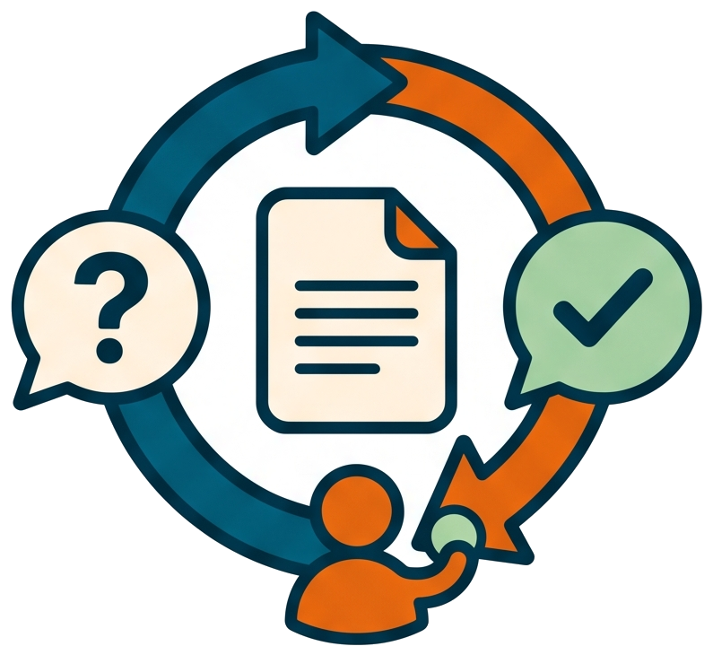

# How to answer a review round



<!-- markdownlint-disable MD013 -->

## Invocation model

The AI creates and later consolidates the review round; the human supplies the
answers. Invoke consolidation directly only when resuming an existing answered
document outside the original automated chain.

## Separate independent-review rounds

This guide covers the human-answered **self-review loop** for open questions.
For the opt-in exchange between separate agents, first read
[why independent review mode separates authority](../explanation/independent-review-mode-and-human-authority.md).

🔁 Goal: answer the open questions a review skill raised on a requirement,
design or plan, and get the answers folded into the document.

## 🔍 What a review round produces

`/review-ask-questions on docs/<type>.vX.Y.Z.<slug>.md` appends an
`## Open questions` section to the document, one `Qxx` block per question.
Each block follows the
[open-question template](../reference/templates.md): a description, a BBQ
rewording (how two people at a barbecue would say it, closed by an
"In this picture: ..." mapping that names the concrete concept behind each
analogy element), two or three
options with pros and cons, and a recommended option. The chat ends with
the summary table:

```txt
| Q0x | Title | Recommended Answer |
```

This is a deliberate stop: nothing runs until a human answers.

## 📋 Steps to answer and fold

1. Read the `Qxx` blocks in the document, not just the table — the options
   and their cons are where the trade-offs live.

2. Answer in the chat, one line per question. Accept the recommendation or
   override it; free-text answers are fine:

   ```txt
   Q01: option A2
   Q02: option B1, but keep the old flag as an alias
   ```

3. Run (or accept) the consolidation:

   ```txt
   /consolidate-then-review-ask-questions on docs/<type>.vX.Y.Z.<slug>.md
   ```

4. The skill runs plain `git reset`, stages only the exact document, writes a
   single-group root `a.commit`, and batch-commits
   `docs(<scope>): record pre-consolidation questions`, using the topic slug
   when it fits or the normalized document type otherwise. It stops before the
   fold if the commit contains another path or the index is not empty afterward.

5. The skill integrates each answer into the document body, records it in
   a decision table (named for the type: requirement clarifications,
   design decisions, implementation decisions), and strips the
   open-questions section with `oqm.bat --strip`.

6. Two endings are possible:

   - new questions are needed — the skill appends a fresh round and stops
     with a new `Q0x` table; go back to step 1,
   - the document is settled — the skill stages every remaining non-ignored
     change with `git add -A`, groups and batch-commits the complete set without
     another menu, and requires `git status --porcelain` to be empty. Only then
     does it run `pw skill` and hand off to the next phase (`/write-design`,
     `/write-plans`, or the implement chain on the plan's first step, whose id
     comes from the validation plan and is not always `1`).

Bare `pw skill` is correct here because the review or consolidation has just
established the document's state. The writing skills use the complementary
`pw skill --after-write requirement|design|plan` form before this point so a
new artifact cannot skip its first review.

## ✋ Holding the chain at the implementation gate

The settled-plan handoff starts the implementation by default. To settle
the plan without starting it, say so in the consolidation invocation:

```txt
/consolidate-then-review-ask-questions on <effort-dir>/plan.vX.Y.Z.<slug>.md stop here
```

Any explicit instruction not to implement works the same way: the skill
still folds the answers, strips the questions and writes the decision
table, then prints the `/implement-step` line as the next step instead of
running it. Without such an instruction, the default stands and the first
step starts at once.

## 🤷 When a round raises no question

The review skill then writes a one-row decision table (its row keeps the
words "No open questions", which the routing reads as the settled
signal), so the document reads as settled and the skill runs `pw skill`
and the command it prints, skipping the consolidation round. The same
`stop here` hold applies when the settled document is a plan.

## ✅ Check after the fold

The snapshot commit immediately before the fold contains only the answered
document. The document then has no `## Open questions` section left, its
decision table references every `Qxx`, all post-fold changes are committed
through `group-commits-msg`, and `git status --porcelain` is empty before
`pw skill` prints the next phase's command.

Related: [Why the LLM reviews its own work](../explanation/why-the-llm-reviews-its-own-work.md),
[Where the human stays in the loop](../explanation/where-the-human-stays-in-the-loop.md).
