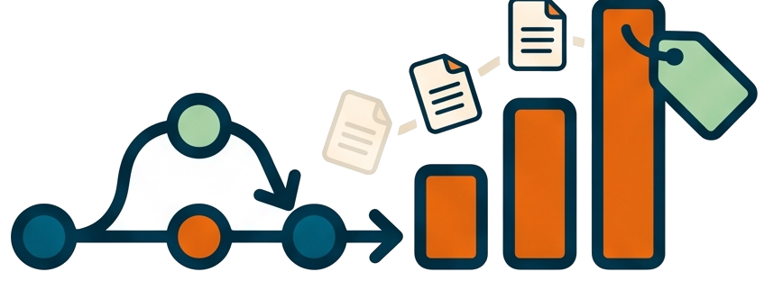

# How to reword a merge commit from the branch docs



<!-- markdownlint-disable MD013 -->

📊 Goal: replace the default `Merge branch '<slug>'` message of a merge
commit with a conventional message built from the documents the merged
branch carried.

## Invocation model

The integration and release workflows ask the AI to update the merge message
after a successful no-fast-forward merge. This applies when a feature enters
`develop` and when a feature, integration, or promotion branch enters `main`.
Use this procedure directly only to repair the current merge commit or to
review the exact mechanics before approving the automated step.

## 📋 Steps from merge to reworded message

1. Create the merge from an up-to-date target branch. Use `develop` when
   integrating a feature, or `main` when accepting work for release:

   ```cmd
   git switch <develop-or-main>
   git pull
   git merge --no-ff <your-branch>
   ```

2. Run the skill:

   ```txt
   /update-merge-commit-msg
   ```

3. It calls `git-extract-merge-docs.sh`, which walks the merged branch's
   lineage, finds the `docs/*.md` files changed between the two parents,
   and dumps their content into `a.docs`.

4. From `a.docs`, the skill writes one single-group conventional message
   into `a.commit` — title, `Why:` paragraphs, `What:` list — formatted by
   `wac.bat --no-delimiters`. A free-form message is refused.

5. Review the message, then say `Go ahead`. The skill runs
   `git-reword-merge.sh` (the `grmc` alias), which rebuilds the merge
   object with `git commit-tree <tree> -p P1 -p P2 -F a.commit`, moves the
   branch ref, and empties `a.commit`.

6. Push with `gp` (or `git push`). Never push `develop` or `main` between
   the merge and the reword.

## 🚀 Inside a release preparation

When `/prepare-release` drives the merge, it signals the skill through the
flag file `a.prepare-release.active` in the review artifact home
(`.reviews`): the reword then hands
control back to the release run instead of closing on its own.

## ✅ Check after the reword

`git log -1` on the target branch shows a `type(scope): subject` title tied
to the merged effort, with the `Why:` / `What:` body — the message changelog
generators and future readers will see.

Related: [Commit message format](../reference/commit-message-format.md),
[Prepare a release from any branch](prepare-a-release.md).
