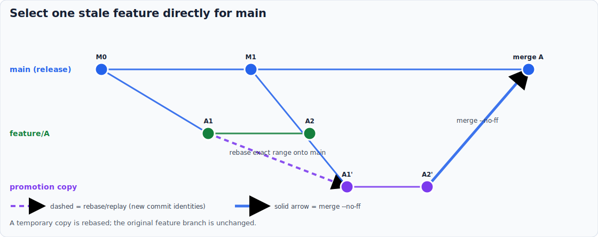

# How to update a Git history diagram


<!-- markdownlint-disable MD013 -->

📊 Goal: change one documented Git topology without letting its SVG and prose
drift apart.



## Invocation model

Diagram regeneration is a documentation-maintenance task, not an internal
prepare-release action. A human may run it directly after changing a scenario,
or ask the AI to update and validate the assets as part of a documentation
review. Direct invocation is useful for rapid visual iteration.

## Edit the declarative scenario

Open `tools/git_history_diagrams/scenarios.py` and change the matching
`Scenario`. Keep branch roles stable: main is blue, develop orange, feature
work green, and temporary promotion copies purple.

Use an `Edge` kind that matches the real operation:

- `history` for ordinary ancestry;
- `rebase` for copied commits created by rebase or exact-range replay;
- `merge` for a `--no-ff` merge with two parents.

If the topology needs a new branch role, add a lane and give every commit a
unique key. Edges may only name declared commit keys.

Use the bulk-release scenario as the negative check: it must retain solid
merge arrows and no dashed rebase arrow.


## Regenerate and inspect

```bat
bin\git_history_diagrams.bat
bin\git_history_diagrams.bat --check
```

Inspect the result at both normal page width and a narrow viewport. Check that
labels do not overlap nodes, dashed arrows describe only copied identities,
and every `--no-ff` decision has a solid arrow.

## Update the surrounding prose

Search the explanation, tutorial, how-to, and reference pages that embed the
asset. Update claims about branch roles, selection scope, and operation order
in that Diátaxis order. Do not turn the SVG into the only source of truth:
alt text and adjacent prose must still state the decision.

## Validate

Run the focused tests for `tests/unit/tools/git_history_diagrams/`, then the
repository's full check. A stale SVG, invalid commit reference, duplicate key,
or unsupported lane fails before publication.

Related: [why the visual grammar is explicit](../explanation/why-git-history-diagrams-use-explicit-arrows.md),
[generation tutorial](../tutorials/07-generate-git-history-diagrams.md), and
[generator reference](../reference/git-history-diagram-generator.md).
