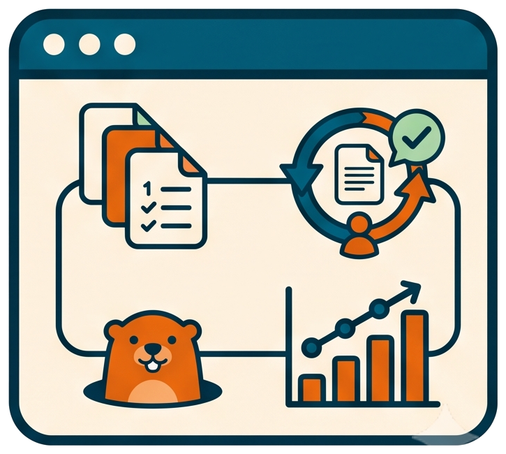

# Automation and direct invocation

<!-- markdownlint-disable MD013 -->

🤖 The ownership contract for llm-shared skills, launchers, and lower-level
tools. "Automated" means the AI owns the next command after the user starts a
workflow; it does not remove the human approval points documented by that
workflow.

## Invocation model

This page is a read-only ownership map rather than an executable procedure. Use
it before invoking a command directly to determine which surrounding checks and
human validation gates the normal AI-orchestrated workflow would provide.

## User starts, AI orchestrates

| Workflow | Normal invocation | What the AI calls | Human role |
| --- | --- | --- | --- |
| Document pipeline | Ask for `process-draft` or the required writing skill | writing, review, consolidation, and `pw skill` handoffs | answer structured questions and validate settled documents |
| Implementation step | Ask for `implement-step N` | Groundhog, implementation check, missing-work repair, and grouped-commit preparation | validate decisions and approve commit replay |
| Release preparation | Ask for `prepare-release` with release intent | planner, conflict previews, synchronization, merges, notes, version updates, and preparation commit | approve topology and notes; run `brel` later |
| History sanitization | Ask for `sanitize-git-history` | contextual scan, rule validation, fresh-clone rewrite, and re-audit | approve replacement rules and destructive phase; push later if desired |
| Reports and maintenance skills | Ask for the named skill | activity/dashboard builders, doc review, file split, or slow-test workflow | validate the requested output |

The user should not be told to run an internal prerequisite merely because it
has a command-line interface. The owning skill calls it and reports the
evidence.

## Commands normally called inside automation

| Command or tool | Normal owner | Call it directly when |
| --- | --- | --- |
| `prepare_release_plan.bat` | `prepare-release` | developing the planner or diagnosing one topology without preparing a release |
| `sensitive_history_scan.bat` / `shscan` | `sanitize-git-history` | performing an ad hoc read-only audit or developing replacement rules |
| `ghog day` and subcommands | implementation and fix skills | learning the loop, diagnosing locally, or running the same quality gate without an AI session |
| `pw handoff` / `pw skill` | workflow skills | debugging routing, resuming a known handoff, or using the interactive menu |
| `gcba.bat` | grouped-commit approval flow | replaying a reviewed `a.commit` plan from a console |
| release-note scripts and changelog tools | `prepare-release` | developing or diagnosing the release-note half independently |

Direct use is supported, but it narrows the contract: the caller must supply
the context, ordering, validation, and follow-up that the owning skill normally
provides.

## Commands intentionally run by a human

| Command or tool | Why it stays direct |
| --- | --- |
| `brel` | it finalizes the version and creates the release tag after preparation review |
| plugin/workflow registration commands | they change the user's AI-host configuration |
| local wiki server | it owns a foreground browser/server session stopped with Ctrl-C |
| `git_history_diagrams.bat` / `ghdiag` | it is a documentation-maintenance generator, not part of release execution |
| presentation rebuild | it creates reviewable presentation artifacts on demand |

An AI may execute a direct maintenance command when the user asks for that
maintenance task. The distinction is about the normal workflow owner, not a
technical restriction.

Related: [Skills catalog](skills-catalog.md), [Aliases and launchers](aliases-and-launchers.md),
and [Where the human stays in the loop](../explanation/where-the-human-stays-in-the-loop.md).
