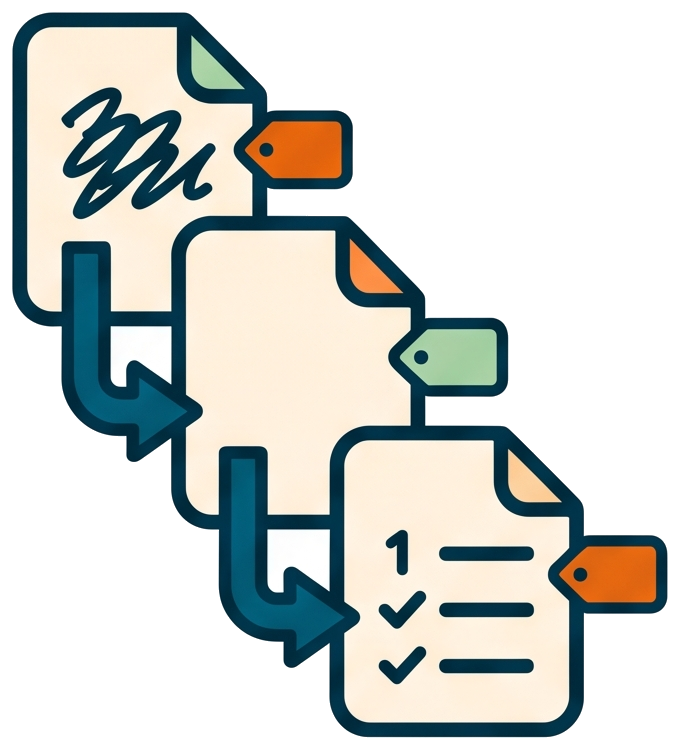

# From draft note to settled requirement



<!-- markdownlint-disable MD013 -->

## Invocation model

You start the tutorial with the draft-processing skill and answer its review
questions. The AI invokes the writing, review, consolidation, and `pw skill`
handoffs; you do not run each intermediate command yourself.

📝 In this tutorial you take a raw idea through the first phase of the
workflow: capture it as a draft, let `/process-draft` classify and branch
it, and drive it to a requirement document with an approved decision
table. Allow 20 to 30 minutes. You need a project wired to llm-shared (see
[the setup tutorial](01-plug-llm-shared-into-your-project.md)) and a
`version.txt` file at the project root.

## 1. Write the draft

Create `docs\draft.progress-log.md` (any name works, no version yet) and
describe, in plain language: the desired behavior, what is missing or
broken today, the constraints, an example, the expected outcome. Do not
think about code; think about what you want.

## 2. Run /process-draft

```txt
/process-draft on docs\draft.progress-log.md
```

The skill reads the draft and walks you through five short menus, one at a
time:

1. the classification (`- Type:` line: one feature-request, one issue, or
   a collection of both) with three witty title proposals,
2. three collision-checked slug proposals,
3. the target version, derived from `version.txt` (keep `X.Y.Z`, or step
   major, minor, or patch),
4. the documentation layout: `docs/`, `docs/vX.Y/`, `docs/vX.Y.Z/`, or
   `docs/vX.Y/vX.Y.Z/`; choose `docs/vX.Y.Z/` in this tutorial,
5. the branch layout: a new sibling worktree, or `git switch -c <slug>` in
   the current tree.

It then calls the `new_draft` tool, which renames the file to
`docs\vX.Y.Z\draft.vX.Y.Z.<slug>.md` and creates the effort branch. The
draft's parent directory is now the effort directory: every later requirement,
design, plan, and validation plan is written beside it.

## 3. Let the chain write the requirement

`/process-draft` ends on a multi-choice fed by `pw skill`. For a
single-topic draft, pick the proposed
`/write-requirement on docs/vX.Y.Z/draft.vX.Y.Z.<slug>.md`. The skill validates
its three inputs (type, version, topic label), then writes
`docs\vX.Y.Z\feature-request.vX.Y.Z.<slug>.md` (or `issue.`) from the
[requirement template](../reference/templates.md).

No "go ahead" is needed here: the writing skill ends by running
`pw skill --after-write requirement`. That explicit handoff prints the
review command for the requirement just created, even if its prose already
contains words that resemble a settled decision. The model runs the printed
command straight away.

### Collection variation: keep the umbrella draft

If `/process-draft` classified the note as a collection, `/split-and-define`
adds `- Draft role: umbrella` and a delivery table. New rows begin as
`pending`, with no document paths:

```md
| Order | Type | Key title | Slug | Status | Requirement | Validation plan |
| --- | --- | --- | --- | --- | --- | --- |
| 1 | Issue | Remove old routes | `route-cleanup` | pending | - | - |
| 2 | Feature-request | Serve the root | `root-routing` | pending | - | - |
```

The skill runs `pw skill --after-merge` on the umbrella. For the first row it
proposes:

```txt
/process-draft on docs/v10.0.0/draft.v10.0.0.sentinel.md based on route-cleanup
```

That continuation validates the table, creates a focused child draft on the
item branch, and keeps the umbrella intact. The child records its parent:

```md
- Umbrella: docs/v10.0.0/draft.v10.0.0.sentinel.md
```

The continuation writes that child as the canonical
`<effort-dir>/draft.vX.Y.Z.<item-slug>.md` file in the item branch, reads it
back to verify it exists, and then stops. Review the file itself before any
requirement is written. The complete copy shown in conversation is only a
preview. Comments revise only the on-disk child and return to the same pause;
say `Go ahead` only when that file expresses the intended item. The skill then
hands the approved child to `/write-requirement`.

After the item's last implementation check, the umbrella row becomes
`completed` and records the requirement and validation-plan paths. Once that
feature is merged into `develop`, `pw skill --after-merge` verifies the evidence
and proposes `process-draft` for `root-routing`. Missing, ambiguous, or stale
relationships stop resolution instead of borrowing an unrelated draft.

## 4. Stop at the review table

That next command is `/review-ask-questions`. The skill challenges the
document it just wrote and posts its open questions as a table:

```txt
| Q0x | Title | Recommended Answer |
```

This is the one human stop of the document phase. Read each `Qxx` block in
the document (options, pros and cons, recommended choice) and answer in
the chat, for example: `Q01: option A2. Q02: option B1.`

## 5. Consolidate and settle

Run (or accept) `/consolidate-then-review-ask-questions on docs\...`. The
skill first clears the index without touching the working tree and commits the
requirement alone with its answered questions. It verifies that the index is
empty, then folds each answer into the document body, records the decisions in
a table, strips the open-questions section, and either asks a new round or
declares the document settled. A settled fold stages every remaining change,
uses `group-commits-msg` to commit the complete set without another menu, and
requires a clean working tree. Only then does `pw skill` hand off to
`/write-design`. The design writer then uses `pw skill --after-write design` to
force design review, and the plan writer uses `pw skill --after-write plan` to
force plan review. Bare `pw skill` remains the state-based handoff after a
review or consolidation has actually settled and cleanly committed a document.

## 6. Look at what landed on disk

```txt
docs\vX.Y.Z\draft.vX.Y.Z.<slug>.md            the classified draft
docs\vX.Y.Z\feature-request.vX.Y.Z.<slug>.md  the requirement with its decision table
Git history                                      one-file snapshot of the answered questions
Git history                                      grouped commits for the settled fold
a.prompt_memory                                the branch-locked workflow state
```

The requirement document now carries not just the need, but the questions
that were asked and the answers that were given: the trail a future reader
(human or LLM) will use.

## 👉 Next steps after the requirement

- [Answer a review round](../how-to/answer-a-review-round.md) for the
  review mechanics in detail.
- [Run the implement chain on one plan step](04-run-the-implement-chain.md)
  once design and plan are settled.
- [Why documents come before code](../explanation/why-documents-before-code.md)
  for the reasoning behind the phases.
