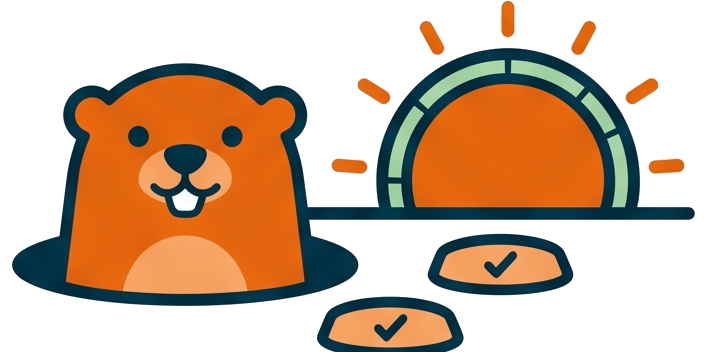

# Your first groundhog walk



<!-- markdownlint-disable MD013 -->

## Invocation model

This tutorial calls `ghog` directly so you can learn its reports. In the normal
implementation workflow the AI invokes the same walk, fixes the reported
failure, coverage gap, or duration outlier, and repeats it automatically.

🧪 In this tutorial you register groundhog in a Python project, run one
`ghog day` walk, and read its report. Allow 15 minutes plus one full test
run. You need a pytest project with a `senv.bat` shell setup and the
llm-shared repository as a sibling folder.

## 1. Register the skill pointers

From the project root:

```cmd
ghog init
```

This writes three pointers, all referencing the single
`instructions/groundhog.md` body: a `.claude\skills\groundhog\SKILL.md`
for Claude Code, a `## groundhog` section appended to `AGENTS.md` for
Codex, and a `~/.codex/prompts/groundhog.md` user-level prompt when
`~/.codex` exists. Re-running it is safe: an already-registered pointer is
recognized and left alone.

## 2. Walk the day

```cmd
ghog day --whole-suite
```

With no `GHOG_FULL` override, this development walk has two stations:

1. `check` — runs `check.bat` (compile, lint, big-file gate),
2. `affected --no-cov` — the tests affected by your changes, fast,
   coverage off.

Now request whole-suite coverage explicitly:

```cmd
ghog day --full=cov --whole-suite
```

The walk adds a full step, measures coverage against `fail_under` (default 100),
and rebuilds testmon in sequential mode. Use `--full=pass` for passing tests
alone, or `--full=speed` to add the duration gate. These explicit parameters
override `GHOG_FULL` and `GHOG_GROUP` from your console.

In a console you see a progress bar with live counters; the run ends on a
key=value closing line such as:

```txt
myproject: ghog day done fail=0 warn=0 xfail=11 cov=100 exit=0 full=cov src=param proof=cov reused=none scope=whole
```

## 3. Read the verdict

The exit code is the branching signal: `0` means objective reached, `2`
test failures, `3` a coverage gap, `8` a speed run with one test far
slower than the rest. Each stop names its own next move in the report —
`ghog single <failing files>` after a full-run failure, `covg` on the
uncovered lines after a gap. The full contract is in
[ghog commands and exit codes](../reference/ghog-commands-and-exit-codes.md).

## 4. Run it a second time

```cmd
ghog day --full=cov --whole-suite
```

If sources, gate configuration, and scope still match the saved proof, this
second run skips everything, even check. `proof=cov reused=all scope=whole`
shows why. The marker `a.ghog.day.ok` lives in the artifact home (`.reviews`
by default). Change a Python file and the walk re-arms; add `--force` to run
regardless. A later `--full=speed` request can reuse check and affected tests
while upgrading the proof with a full speed run.

## 5. Hand the loop to the LLM

Ask your agent to "run groundhog day --full=cov --whole-suite". The model then
follows the fixing loop: run the walk redirected to `a.ghog.log`, apply
the fix the report names, walk again, and stop when green or when an
iteration makes no progress. You can follow the run live from a second
console:

```cmd
type a.ghog.log
```

## 👉 Next steps after the first walk

- [Fix a red groundhog walk](../how-to/fix-a-red-groundhog-walk.md) for
  the per-exit-code recipes.
- [Groundhog as a reset loop](../explanation/groundhog-as-a-reset-loop.md)
  for why the tool relives the day instead of watching files.
