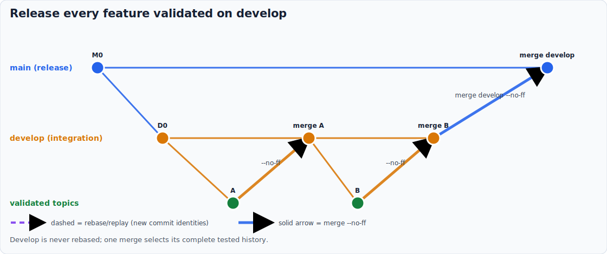

# Prepare your first release from develop


<!-- markdownlint-disable MD013 -->

## Invocation model

You invoke `prepare-release` from develop and state that all integrated work is
selected. The AI calls the planner, Git previews, merge-message, note, and
version tools. You run `brel` yourself only after reviewing the prepared main.

📊 In this tutorial you promote everything already integrated on `develop`
into `main`, prepare the release artifacts, and stop before the tag. You need
a clean project with `version.txt`, the dev_workflow build, a released tag,
and at least one newer versioned effort document.

## 1. Check out the integration branch

```bash
git switch develop
git status --short --branch
```

The tree should be clean. In this repository convention, `develop` is both
the hosting default and the long-lived continuous-integration branch; `main`
is reserved for releases and tags. The skill recognizes local `develop` as
the integration branch. A project with another name can declare it once:

```bash
git config prepare-release.integrationBranch integration
```

## 2. Start the preparation

```txt
$llm-shared:prepare-release
```

Explain the context in the same request, for example: "prepare v9.13.5 from
develop; the v9.14.0 and v10.0 documents are future notes." You do not run
`prepare_release_plan.bat`. The skill locates and invokes it automatically,
first to classify the topology and then to preview the exact merge after main
is current. It also checks the Git version and working-tree cleanliness. A
dirty tree stops at the documented commit-or-abort choice.

Read the detection summary before accepting anything. It should say:

- mode: integration release,
- source: `develop`, target: `main`,
- scope: every commit in `main..develop`,
- action: `git merge --no-ff develop`,
- target: the lowest effort-document version newer than the last tag.

The `main..develop` scope must contain at least one commit. Equal refs also
satisfy Git's ancestor test, so an ancestry-only planner can say
`merge-no-ff` even though Git would answer “Already up to date.” The skill
checks the range independently and stops. If main has unreleased work, check
out main and invoke the skill there only when you intend to release all of
`last_tag..main`; otherwise there is nothing to promote from develop.

For a current develop branch, the automatic planner evidence should report
`integration`, `merge-no-ff`, scope `main..develop`, and a clean or conflicted
merge preview. If develop lacks main, expect `sync-integration-then-merge`;
the preview then applies to the main-into-develop synchronization. Read any
predicted conflict paths and types before approving the operation.

Later effort and draft document versions can appear as forward-looking notes.
They stay in the selected branch content but do not replace the next target
version; drafts never trigger a release by themselves.

## 3. Confirm the bulk promotion



When main is already an ancestor of develop, choose `Go ahead`. The skill
switches this worktree to main, performs the non-fast-forward merge, and
rewords the merge through `update-merge-commit-msg`.

If develop does not contain the latest main, the skill does not rebase it. It
offers to merge main into develop, runs the `ghog day` gate there, and only
then returns to the promotion.

## 4. Review the release notes

The skill sets `version.txt` to `X.Y.Z-SNAPSHOT`, prepares `CHANGELOG.md`, and
pauses. Refine the summary or ask for `.changelog.fixes` changes. Choose
`Go ahead` only when the rendered notes say what the release should say.

The skill then updates `pyproject.toml` and `uv.lock` when present and creates:

```txt
chore(release): prepare for vX.Y.Z release
```

## 5. Finish outside the skill

Review the merge and prepare commits on main. Then run `brel` yourself to
build, finalize the version, and create the tag. The skill never pushes and
never tags.

## What you learned

The invocation branch selects content; the effort documents select the next
version label. Starting from develop means “release all integrated work,” so
the safe operation is one non-fast-forward merge, not a rebase of the
long-lived branch. `merge-tree` gives you conflict evidence for that exact
operation before the skill changes history.

You also learned where this path sits relative to
[gitworkflow](https://git-scm.com/docs/gitworkflows), one word. Normal
gitworkflow graduates each tested topic independently from integration to
main. Starting from develop is the deliberate all-topics-ready optimization;
do not use it when an arbitrary subset still needs to be selected.

You also learned that an unsupported selection still produces a useful
handoff. For all-but-one, the skill identifies the candidate merge and gives
you a review-branch revert, verification, restoration, and re-entry runbook.
For an arbitrary subset, it gives per-topic evidence and tells you to promote
those topics separately before preparing the artifacts once from main.

This repository differs from canonical gitworkflow by rebasing a feature onto
develop before its integration `--no-ff` merge and, when selected, replaying
that logical feature onto main for a second `--no-ff` merge. Develop is also a
long-lived default branch rather than a throw-away `next` branch.

Next: [Prepare a release in every supported scenario](../how-to/prepare-a-release.md)
and [Prepare-release scenarios](../reference/prepare-release-scenarios.md).
