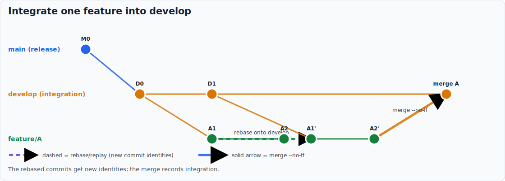
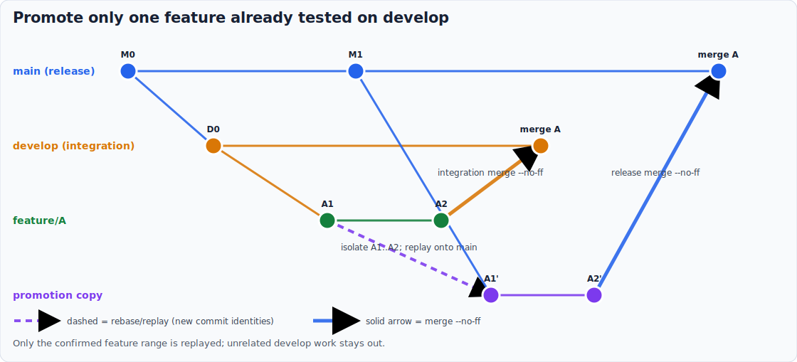

# Generate the Git history diagrams


<!-- markdownlint-disable MD013 -->

## Invocation model

Diagram generation is direct documentation maintenance: a human or an AI
assigned a docs update runs `ghdiag`. Prepare-release consumes the documented
ideas but does not generate these assets during a release.

📊 In this tutorial you generate the four prepare-release history diagrams,
inspect their visual grammar, and verify that the committed SVG files are
current.

## 1. Generate the assets

From the llm-shared repository, run the self-locating launcher:

```bat
bin\git_history_diagrams.bat
```

With `senv.bat` loaded in an interactive console, the equivalent alias is:

```bat
ghdiag
```

The command writes four SVG files under `wiki/assets/prepare-release/`.



## 2. Read one history

Open `feature-from-develop-to-main.svg`. Follow the solid ancestry from the
feature's fork, then the solid integration merge into develop. The dashed
arrow copies only the confirmed feature range onto a purple promotion branch.
The final thick solid arrow merges that copy into main with `--no-ff`.

The diagram therefore shows two different approvals of one logical feature:
integration testing on develop, then release selection on main.



## 3. Compare the all-ready path

Open `develop-to-main.svg`. It has feature merges on develop and one final
solid merge into main. There is no dashed arrow because a shared, long-lived
develop branch is never rebased for a bulk release.

## 4. Check freshness

```bat
bin\git_history_diagrams.bat --check
```

Status `0` means every committed SVG exactly matches the declarative source.
Change one SVG by hand and the check reports it as stale; regenerate to restore
the canonical output.

## What you learned

The diagrams are reproducible documentation artifacts. Their colors describe
branch roles, while dashed rebase/replay arrows and solid merge arrows describe
history-changing operations.

Next: [update a scenario](../how-to/update-git-history-diagrams.md), then use
the [command reference](../reference/git-history-diagram-generator.md) when
you need exact options and exit statuses.
